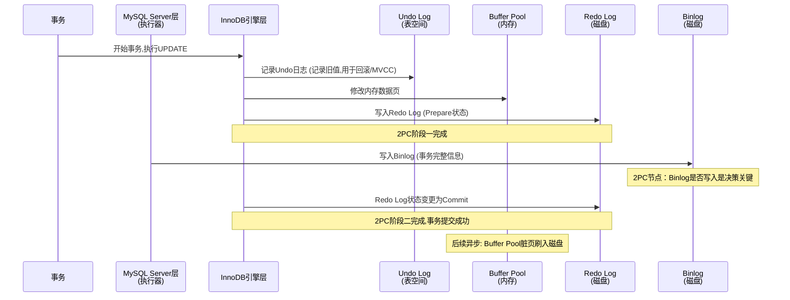

# DAY1 SQL 查询基础知识解答

## 1. `AND` 与 `OR` 的优先级

**`AND` 优先级高于 `OR`**（类似数学中乘法优先于加法）

```sql
sql-- 以下两个语句等价
WHERE a=1 AND b=2 OR c=3
WHERE (a=1 AND b=2) OR c=3  -- AND 先执行

-- 如果想让 OR 先执行，必须加括号
WHERE a=1 AND (b=2 OR c=3)
```

**优先级顺序**：`NOT` > `AND` > `OR`

## 2. `IS NULL` vs `= NULL`

| 写法      | 结果            | 说明                       |
| --------- | --------------- | -------------------------- |
| `IS NULL` | ✅ 正确判断      | 返回 TRUE/FALSE            |
| `= NULL`  | ❌ 永远返回 NULL | NULL 与任何值比较都是 NULL |

```sql
sql-- ✅ 正确
SELECT * FROM users WHERE email IS NULL;

-- ❌ 错误（永远不会匹配任何行）
SELECT * FROM users WHERE email = NULL;

-- ✅ 判断非空
WHERE email IS NOT NULL;
```

**原因**：NULL 表示"未知"，`unknown = unknown` 的结果还是 unknown（不是 TRUE）

## 3. `LIKE` 通配符匹配范围

| 模式           | 匹配规则                 | 示例匹配                         |
| -------------- | ------------------------ | -------------------------------- |
| `LIKE '%abc%'` | **包含** abc（任意位置） | `abc`, `xabc`, `abcx`, `xabcx`   |
| `LIKE 'abc%'`  | **以 abc 开头**          | `abc`, `abc123`, `abcdef`        |
| `LIKE '%abc'`  | **以 abc 结尾**          | `abc`, `xabc`, `123abc`          |
| `LIKE '_abc%'` | 第二个字符是a            | `aabc`, `xabc`（_ 匹配单个字符） |

## 4. 查找包含真实 `_` 字符

使用 `ESCAPE` 指定转义字符：

```sql
sql-- 查找包含真实下划线的记录
SELECT * FROM products 
WHERE name LIKE '%\_%' ESCAPE '\';

-- 查找包含真实 % 的记录
WHERE name LIKE '%\%%' ESCAPE '\';

-- 也可以用其他转义字符
WHERE name LIKE '%!_%' ESCAPE '!';
```

## 5. 字符串大小写敏感性

**由数据库的排序规则（Collation）决定**：

| 数据库         | 默认行为                    | 修改方式                                |
| -------------- | --------------------------- | --------------------------------------- |
| **MySQL**      | 不区分（`utf8_general_ci`） | 使用 `BINARY` 或 `_cs` 结尾的 collation |
| **PostgreSQL** | 区分大小写                  | 使用 `ILIKE` 不区分                     |
| **SQL Server** | 取决于 collation            | `CI` 不区分，`CS` 区分                  |
| **Oracle**     | 区分                        | 使用 `UPPER()` 函数                     |

```sql
sql-- MySQL 区分大小写
WHERE BINARY name = 'ABC';  -- 只匹配 'ABC'，不匹配 'abc'

-- PostgreSQL 不区分大小写
WHERE name ILIKE 'abc';  -- 匹配 'ABC', 'abc', 'AbC'

-- 通用方法（强制不区分）
WHERE UPPER(name) = 'ABC';

-- 通用方法（强制区分）
WHERE BINARY name = 'ABC';  -- MySQL
WHERE name COLLATE Latin1_General_CS_AS = 'ABC';  -- SQL Server
```

**关键点**：永远不要假设大小写行为，应根据具体数据库和业务需求明确处理！


# DAY2 MySQL 排序与分页详解

## 1. ORDER BY a, b DESC 的排序优先级是什么？

核心规则：**从左到右依次排序，后面的字段只在前面字段相同时才生效**。

`ORDER BY a, b DESC` 等价于 `ORDER BY a ASC, b DESC`，执行逻辑是：

1. 先按 a 升序排列
2. 当 a 相同时，再按 b 降序排列
3. 当 a 和 b 都相同时，保持原始顺序（不稳定）

实际示例：

```sql
sqlCREATE TABLE scores (
    name VARCHAR(20),
    subject VARCHAR(20),
    score INT
);

INSERT INTO scores VALUES
('张三', '数学', 90),
('张三', '英语', 85),
('李四', '数学', 90),
('李四', '英语', 95),
('王五', '数学', 80);

SELECT * FROM scores ORDER BY name, score DESC;
```

结果：

```
+------+--------+-------+
| name | subject| score |
+------+--------+-------+
| 张三 | 数学   | 90    |  ← name='张三'，按score降序
| 张三 | 英语   | 85    |
| 李四 | 英语   | 95    |  ← name='李四'，按score降序
| 李四 | 数学   | 90    |
| 王五 | 数学   | 80    |
+------+--------+-------+
```

常见误区：

- ❌ 错误理解：认为会先按 b 排序，再按 a 排序
- ✅ 正确理解：每个字段可以独立指定排序方向
- ❌ 错误：`ORDER BY (a, b) DESC`（语法错误）
- ✅ 正确：`ORDER BY a ASC, b DESC, c ASC`（完全合法）

------

## 2. LIMIT m,n 中 m 和 n 分别代表什么？

语法：`LIMIT offset, count`

| 参数         | 含义            | 说明          |
| ------------ | --------------- | ------------- |
| `m` (offset) | **跳过前 m 行** | 从 0 开始计数 |
| `n` (count)  | **返回 n 行**   | 最多返回 n 行 |

图解：

```
数据行：  [0] [1] [2] [3] [4] [5] [6] [7] [8] [9] ...
                   ↑           ↑
                   m=3         n=4
                   
执行 LIMIT 3, 4：
1. 跳过前 3 行（0,1,2）
2. 返回接下来的 4 行（3,4,5,6）

结果：[3] [4] [5] [6]
```

实际示例：

```sql
sqlSELECT * FROM users LIMIT 3, 4;  -- 返回第4~7行

-- 等价写法
SELECT * FROM users LIMIT 4 OFFSET 3;

-- 常见用法
LIMIT 0, 10   -- 前10行（和 LIMIT 10 一样）
LIMIT 5, 10   -- 第6~15行
LIMIT 10, 10  -- 第11~20行
```

⚠️ 性能陷阱：

```sql
sql-- ❌ 大偏移量会很慢！
SELECT * FROM big_table LIMIT 1000000, 10;
-- MySQL 需要扫描前 1000010 行，丢弃前 1000000 行
-- 时间复杂度：O(m+n)

-- ✅ 优化方案：用 WHERE 替代 OFFSET
SELECT * FROM big_table 
WHERE id > (SELECT id FROM big_table ORDER BY id LIMIT 1000000, 1)
LIMIT 10;
-- 时间复杂度：O(n)
```

------

## 3. 如何写第 5 页、每页 20 条的分页 SQL？

计算公式：

```
页号从 1 开始：
offset = (页号 - 1) × 每页条数
count = 每页条数

第5页，每页20条：
offset = (5 - 1) × 20 = 80
count = 20

SQL：LIMIT 80, 20
```

完整写法：

```sql
sql-- 方法1：直接计算（最常用）
SELECT * FROM users ORDER BY id LIMIT 80, 20;

-- 方法2：使用 OFFSET（语义更清晰）
SELECT * FROM users ORDER BY id LIMIT 20 OFFSET 80;

-- 方法3：应用层计算（推荐）
-- Python 示例
page = 5
page_size = 20
offset = (page - 1) * page_size
sql = f"SELECT * FROM users ORDER BY id LIMIT {page_size} OFFSET {offset}"
```

分页查询模板：

```sql
sql-- 带排序的分页（必须有 ORDER BY！）
SELECT id, name, email 
FROM users 
WHERE status = 'active'
ORDER BY created_at DESC
LIMIT {offset}, {page_size};

-- 统计总页数（应用层计算）
SELECT COUNT(*) as total FROM users WHERE status = 'active';
-- total_pages = CEIL(total / page_size)
```

不同数据库的分页语法：

| 数据库             | 语法                                            |
| ------------------ | ----------------------------------------------- |
| MySQL / PostgreSQL | `LIMIT offset, count`                           |
| SQL Server         | `OFFSET offset ROWS FETCH NEXT count ROWS ONLY` |
| Oracle 12c+        | `OFFSET offset ROWS FETCH NEXT count ROWS ONLY` |
| Oracle 旧版        | `WHERE ROWNUM BETWEEN m AND n`（需嵌套）        |

------

## 4. 为什么分页查询要有稳定排序键？

核心问题：**没有稳定排序，分页会重复或丢失数据**。

灾难示例：

```sql
sql-- 假设有数据（id 不连续，可能有删除）
CREATE TABLE logs (
    id INT,
    content VARCHAR(100),
    created_at DATETIME
);

INSERT INTO logs VALUES
(1, '日志1', '2024-01-01 10:00:00'),
(2, '日志2', '2024-01-01 10:01:00'),
(3, '日志3', '2024-01-01 10:02:00'),
(4, '日志4', '2024-01-01 10:03:00'),
(5, '日志5', '2024-01-01 10:04:00');

-- ❌ 错误：没有 ORDER BY
-- 第1页：LIMIT 0, 2 → 可能返回 [3, 1]（顺序不确定）
-- 第2页：LIMIT 2, 2 → 可能返回 [1, 4]（1重复了！）
```

为什么会出问题？

```
没有 ORDER BY 时：
1. MySQL 不保证返回顺序（取决于存储引擎、索引、缓存等）
2. 每次查询的顺序可能不同
3. 分页时，上一页的最后一条和下一页的第一条可能是同一行

有 ORDER BY 时：
1. 顺序固定
2. 分页边界清晰
3. 不会重复或丢失
```

真实案例：电商订单分页

```sql
sql-- ❌ 危险！
SELECT * FROM orders LIMIT 20, 20;
-- 可能出现：
-- 第1页最后一条是 order_id=100
-- 第2页第一条也是 order_id=100（重复了！）
-- 因为中间插入了新订单，原始顺序变了

-- ✅ 安全
SELECT * FROM orders ORDER BY order_id ASC LIMIT 20, 20;
```

什么是"稳定排序键"？

| 排序键                 | 稳定性     | 推荐度     |
| ---------------------- | ---------- | ---------- |
| **主键（自增ID）**     | ⭐⭐⭐⭐⭐ 完美 | ⭐⭐⭐⭐⭐ 首选 |
| **唯一索引+时间戳**    | ⭐⭐⭐⭐ 较好  | ⭐⭐⭐⭐ 推荐  |
| **时间戳（可能重复）** | ⭐⭐⭐ 一般   | ⭐⭐⭐ 可用   |
| **无 ORDER BY**        | ⭐ 危险     | ❌ 禁止     |

最佳实践：

```sql
sql-- ✅ 推荐：主键 + 业务字段
SELECT * FROM users ORDER BY id ASC, created_at DESC LIMIT 80, 20;

-- ✅ 推荐：业务唯一字段
SELECT * FROM orders ORDER BY order_no ASC, created_at ASC LIMIT 80, 20;

-- ❌ 避免：只用可能重复的字段
SELECT * FROM logs ORDER BY created_at LIMIT 80, 20;

-- ✅ 改进：加主键兜底
SELECT * FROM logs ORDER BY created_at, id LIMIT 80, 20;
```

------

## 5. 旧版本 MySQL 如何生成查询行号？

背景：MySQL 8.0 之前没有 `ROW_NUMBER()` 窗口函数。

方法1：用户变量法（最经典）⭐⭐⭐⭐⭐

```sql
sql-- 生成连续行号
SELECT 
    @row_num := @row_num + 1 AS row_num,
    name,
    score
FROM scores, (SELECT @row_num := 0) AS init
ORDER BY score DESC;
```

结果：

```
+------+------+-------+
| row_num | name | score |
+------+------+-------+
|       1 | 李四 |    95 |
|       2 | 张三 |    90 |
|       3 | 李四 |    90 |
|       4 | 王五 |    80 |
|       5 | 张三 |    85 |
+---------+------+-------+
```

原理：

```
1. 初始化变量：@row_num := 0
2. 每读一行，执行 @row_num := @row_num + 1
3. 因为 SELECT 是逐行执行的，所以能生成连续序号
```

方法2：分组行号（模拟 PARTITION BY）⭐⭐⭐⭐

```sql
sql-- 按班级分组，每个班内排名
SELECT 
    class,
    name,
    score,
    @row_num := IF(@prev_class = class, @row_num + 1, 1) AS row_num,
    @prev_class := class
FROM scores, (SELECT @row_num := 0, @prev_class := NULL) AS init
ORDER BY class, score DESC;
```

结果：

```
+------+------+-------+---------+---------------+
| class | name | score | row_num | @prev_class   |
+-------+------+-------+---------+---------------+
| 一班  | 李四 |    95 |       1 | 一班          |
| 一班  | 张三 |    90 |       2 | 一班          |
| 二班  | 王五 |    85 |       1 | 二班          |
| 二班  | 赵六 |    80 |       2 | 二班          |
+-------+------+-------+---------+---------------+
```

原理：

```
1. 用 @prev_class 记录上一行的班级
2. 如果班级相同，行号+1
3. 如果班级不同，行号重置为1
4. 实现了"分组内连续编号"
```

方法3：自连接计数法（兼容性最好）⭐⭐⭐

```sql
sql-- 生成排名（不要求连续）
SELECT 
    t1.name,
    t1.score,
    COUNT(t2.score) AS rank
FROM scores t1
LEFT JOIN scores t2 ON t1.score < t2.score
GROUP BY t1.name, t1.score
ORDER BY rank;
```

结果：

```
+------+-------+------+
| name | score | rank |
+------+-------+------+
| 李四 |    95 |    1 |
| 张三 |    90 |    2 |
| 李四 |    90 |    2 |  -- 并列第2
| 张三 |    85 |    4 |  -- 跳过了3（因为有并列）
| 王五 |    80 |    5 |
+------+-------+------+
```

原理：

```
对于每一行 t1：
  统计有多少行 t2 的 score > t1.score
  这个数量 + 1 就是排名

优点：不依赖变量，兼容性好
缺点：性能差（O(n²)），大数据量会很慢
```

方法4：子查询计数法 ⭐⭐

```sql
sqlSELECT 
    name,
    score,
    (SELECT COUNT(*) + 1 
     FROM scores t2 
     WHERE t2.score > t1.score) AS rank
FROM scores t1
ORDER BY rank;
```

和方法3类似，但用相关子查询实现。

对比：新旧版本生成行号

| 特性     | MySQL 8.0+                | MySQL 5.7             |
| -------- | ------------------------- | --------------------- |
| 语法     | `ROW_NUMBER() OVER (...)` | 用户变量 / 自连接     |
| 性能     | ⭐⭐⭐⭐⭐ 优化过              | ⭐⭐ 变量法快，自连接慢 |
| 可读性   | ⭐⭐⭐⭐⭐ 清晰                | ⭐⭐ 变量法晦涩         |
| 分组排名 | `PARTITION BY`            | 变量模拟              |
| 兼容性   | 仅 8.0+                   | 所有版本              |

MySQL 8.0+ 写法（推荐）：

```sql
sql-- 基本行号
SELECT 
    ROW_NUMBER() OVER (ORDER BY score DESC) AS row_num,
    name,
    score
FROM scores;

-- 分组排名
SELECT 
    class,
    name,
    score,
    ROW_NUMBER() OVER (PARTITION BY class ORDER BY score DESC) AS rank
FROM scores;

-- 并列排名（不跳号）
RANK() OVER (ORDER BY score DESC)  -- 1,2,2,4
DENSE_RANK() OVER (ORDER BY score DESC)  -- 1,2,2,3
```

性能对比：

| 方法         | 1万行 | 10万行 | 100万行 | 推荐度 |
| ------------ | ----- | ------ | ------- | ------ |
| 用户变量法   | 10ms  | 100ms  | 1s      | ⭐⭐⭐⭐⭐  |
| 自连接法     | 500ms | 50s    | ❌ 超时  | ⭐⭐     |
| 子查询法     | 300ms | 30s    | ❌ 超时  | ⭐⭐     |
| ROW_NUMBER() | 5ms   | 50ms   | 500ms   | ⭐⭐⭐⭐⭐  |

最佳实践总结：

```sql
sql-- 分页查询模板
SELECT id, name, email, created_at
FROM users
WHERE status = 'active'
ORDER BY id ASC  -- 稳定排序键！
LIMIT {offset}, {page_size};

-- 同时获取总数
SELECT SQL_CALC_FOUND_ROWS id, name, email
FROM users
WHERE status = 'active'
ORDER BY id ASC
LIMIT 80, 20;

SELECT FOUND_ROWS();  -- 获取总数
```

行号生成选择：

| 场景                | 推荐方法                       |
| ------------------- | ------------------------------ |
| MySQL 8.0+          | `ROW_NUMBER() OVER (...)`      |
| MySQL 5.7，小数据量 | 用户变量法                     |
| MySQL 5.7，大数据量 | 考虑升级到 8.0，或用应用层处理 |
| 兼容性要求极高      | 自连接法（但只用于小数据）     |

一句话总结：**分页必须加 ORDER BY 主键，行号旧版本用变量法，新版本用窗口函数。没有稳定排序的分页就是灾难！**


# DAY3 SQL 聚合函数与分组常见问题

## 1. `COUNT(*)` 和 `COUNT(column)` 的区别是什么？

`COUNT(*)` 统计所有行，包括含有 `NULL` 值的行；`COUNT(column)` 只统计该列非 `NULL` 的行数。

```sql
-- 统计表中所有记录数（含 NULL）
SELECT COUNT(*) FROM orders;

-- 统计 user_id 不为 NULL 的记录数
SELECT COUNT(user_id) FROM orders;

-- 统计去重后的非 NULL 值
SELECT COUNT(DISTINCT user_id) FROM orders;
```

**关键区别：**
- `COUNT(*)`：不忽略任何行，即使整行都是 `NULL`
- `COUNT(column)`：忽略该列为 `NULL` 的行
- `COUNT(DISTINCT column)`：忽略 `NULL` 且去重

---

## 2. `GROUP BY` 后 SELECT 中能直接写非分组列吗？

**MySQL 中宽松模式下可以，但标准 SQL 和严格模式下不允许。** 非分组列必须出现在聚合函数中，或使用 `ANY_VALUE()`（MySQL）。

```sql
-- ❌ 标准 SQL 报错：name 未出现在 GROUP BY 中
SELECT department, name, AVG(salary)
FROM employees
GROUP BY department;

-- ✅ 正确写法：非分组列放入聚合函数
SELECT department, MAX(name), AVG(salary)
FROM employees
GROUP BY department;

-- ✅ MySQL 严格模式下的替代方案
SELECT department, ANY_VALUE(name), AVG(salary)
FROM employees
GROUP BY department;
```

**原则：** `SELECT` 中的列要么在 `GROUP BY` 中，要么被聚合函数包裹。

---

## 3. 如何做条件聚合？

使用 `CASE WHEN` 嵌套在聚合函数中，或使用 `FILTER`（PostgreSQL）。

```sql
-- 统计各状态订单数（行转列）
SELECT
    SUM(CASE WHEN status = 'paid' THEN 1 ELSE 0 END) AS paid_count,
    SUM(CASE WHEN status = 'pending' THEN 1 ELSE 0 END) AS pending_count,
    SUM(CASE WHEN status = 'cancelled' THEN 1 ELSE 0 END) AS cancelled_count
FROM orders;

-- 条件求和：只统计 2024 年的销售额
SELECT
    SUM(CASE WHEN YEAR(order_date) = 2024 THEN amount ELSE 0 END) AS sales_2024
FROM orders;

-- PostgreSQL 专用语法
SELECT
    COUNT(*) FILTER (WHERE status = 'paid') AS paid_count
FROM orders;
```

---

## 4. `AVG` 会不会统计 `NULL`？

**不会。** `AVG(column)` 自动忽略 `NULL` 值，只计算非 `NULL` 行的平均值。

```sql
-- 示例数据：scores = [80, 90, NULL, 70]
-- AVG(scores) = (80 + 90 + 70) / 3 = 80.00，NULL 被忽略

SELECT AVG(score) FROM exam_results;

-- 如需将 NULL 视为 0 参与计算
SELECT AVG(COALESCE(score, 0)) FROM exam_results;
-- 结果：(80 + 90 + 0 + 70) / 4 = 60.00
```

**注意：** `AVG` 的分母是**非 NULL 的行数**，不是总行数。

---

## 5. 如何计算点击率并避免除以 0？

使用 `NULLIF` 将分母为 0 的情况转换为 `NULL`，再用 `COALESCE` 转为 0 或其他默认值。

```sql
-- 点击率 = 点击次数 / 展示次数
SELECT
    clicks,
    impressions,
    COALESCE(clicks * 1.0 / NULLIF(impressions, 0), 0) AS ctr
FROM ad_stats;

-- 解释：
-- NULLIF(impressions, 0) → 如果 impressions=0，返回 NULL
-- clicks / NULL → 结果为 NULL（避免除以 0 报错）
-- COALESCE(..., 0) → 将 NULL 转为 0.00
```

**其他写法：**

```sql
-- 使用 CASE WHEN
SELECT
    CASE 
        WHEN impressions = 0 THEN 0.00
        ELSE ROUND(clicks * 100.0 / impressions, 2)
    END AS ctr_percentage
FROM ad_stats;
```


# DAY4 SQL中WHERE与HAVING的相关问题解答

## 1. `WHERE`和 `HAVING`的核心区别是什么？

核心区别在于**作用时机**和**适用场景**：`WHERE`用于**分组前**过滤行级数据，不能直接使用聚合函数；`HAVING`用于**分组后**过滤组级数据，必须配合`GROUP BY`使用（或无`GROUP BY`时对全表作为一组过滤），可直接使用聚合函数。`WHERE`过滤的是原始表的每一行，`HAVING`过滤的是`GROUP BY`后的组统计结果。

## 2. 为什么 `WHERE COUNT(*) > 1`不合法？

因为`WHERE`子句的执行时机在**分组之前**，此时数据库尚未计算聚合函数（如`COUNT(*)`的结果，无法在行级过滤阶段获取聚合值。聚合函数的计算发生在分组之后，因此不能在`WHERE`中使用聚合函数，必须用`HAVING`过滤聚合结果。

## 3. `HAVING`能不能使用聚合别名？

取决于数据库实现：**标准SQL中不允许**（`HAVING`执行顺序早于`SELECT`，别名尚未生效）；但部分数据库（如MySQL）支持此扩展特性。为保证兼容性，建议直接使用聚合表达式（如`AVG(score)`）而非别名。

## 4. 行级过滤应写在哪里？

行级过滤（对原始表每一行的条件筛选）应写在**`WHERE`子句**中。例如筛选年龄>18的用户：`WHERE age > 18`，可在分组前提前过滤无效行，减少后续计算量。

## 5. 如何筛选平均分大于90的班级？

需先按班级分组计算平均分，再用`HAVING`过滤。示例SQL：

```
SELECT class_id, AVG(score) AS avg_score
FROM student_scores
GROUP BY class_id
HAVING AVG(score) > 90; -- 兼容写法，若数据库支持别名可替换为HAVING avg_score > 90
```


# DAY5 SQL条件运算符常见问题解答

## 1. `BETWEEN`是否包含左右边界？

标准SQL中`BETWEEN`**包含左右边界**，等价于`>=左边界 AND <=右边界`。例如`BETWEEN 10 AND 20`会匹配10、15、20等值。需注意：日期类型的`BETWEEN`在部分数据库（如Oracle）中可能隐含时间精度问题，但数值和字符串类型均遵循标准包含规则。

## 2. `IN`和多个 `OR`在表达上有什么区别？

表达上，`IN`更简洁易读，尤其当条件值较多时（如`IN (1,2,3,4)`比`OR id=1 OR id=2...`更清晰）；功能上，`IN`支持子查询结果作为条件（如`IN (SELECT id FROM table)`），而多个`OR`无法直接嵌套子查询。性能上，主流数据库优化器会将`IN`自动转换为等价的`OR`逻辑，二者执行效率基本一致。

## 3. `NOT IN`遇到 `NULL`有什么坑？

若`NOT IN`的子查询或值列表中存在`NULL`，会导致**整个条件返回空结果**。因为SQL中`NULL`与任何值的比较（包括`!=`）都返回`UNKNOWN`，而`NOT IN`本质是多个`AND`连接的不等式（如`NOT IN (1,2,NULL)`等价于`col!=1 AND col!=2 AND col!=NULL`），只要有一个`UNKNOWN`，整个条件就不成立，最终无匹配行。

## 4. `LIKE '%abc'`和 `LIKE 'abc%'`分别表示什么？

- `%`是通配符，代表任意长度（包括0）的字符： `LIKE '%abc'`：匹配**结尾为`abc`**的字符串，如`"xabc"`、`"123abc"`，但不匹配`"abcx"`； `LIKE 'abc%'`：匹配**开头为`abc`**的字符串，如`"abcx"`、`"abc123"`，但不匹配`"xabc"`。

## 5. `IS NULL`和空字符串如何同时排除？

需同时判断非`NULL`和非空字符串，用`AND`连接条件：`WHERE column IS NOT NULL AND column != ''`。注意：`NULL`表示无值，空字符串`''`是有值的特殊字符串，二者不等价——`column <> ''`会漏掉`NULL`，`column IS NOT NULL`会保留空字符串，必须分开判断。


# DAY6 SQL JOIN相关问题解答

## 1. `INNER JOIN`只返回什么数据？

`INNER JOIN`仅返回两个表中**满足连接条件的交集数据**，即只保留两表中都存在匹配关系的行，不匹配的行会被排除。

## 2. `JOIN ... ON`和 `WHERE`分别适合写什么条件？

`JOIN ... ON`适合写**表之间的连接条件**（如外键关联规则），用于定义表如何关联；`WHERE`适合写**结果集过滤条件**（如行级筛选规则），用于从连接后的临时结果中筛选符合要求的数据。

## 3. 自连接适合解决什么问题？

自连接适合处理**同一表中存在层级或关联关系**的场景，例如员工表中的上下级关系（员工ID与经理ID同表）、分类表的父子分类、路径查询等，通过将同一表视为两张独立表进行关联分析。

## 4. 多表字段同名时如何消歧？

需用**表名或表别名作为前缀**消歧，例如`table1.id`、`t2.name`（其中`t2`是表的别名），明确指定字段所属的表。

## 5. 漏写连接条件会产生什么结果？

漏写连接条件会产生**笛卡尔积**，即两表所有行的组合（结果行数为两表行数的乘积），导致结果集异常庞大，通常属于错误操作，可能引发严重性能问题。


# DAY7 SQL外连接与数据筛选相关问题解答

## 1. `LEFT JOIN`与 `INNER JOIN`的结果差异是什么？

LEFT JOIN会返回左表的所有行，即使右表没有匹配的记录，此时右表字段显示为NULL；INNER JOIN仅返回两表中存在匹配关系的行，不匹配的行会被排除。

## 2. 如何找出 A 表有、B 表没有的数据？

可以通过LEFT JOIN结合右表主键为NULL的条件实现：SELECT a.* FROM A a LEFT JOIN B b ON a.key = b.key WHERE b.key IS NULL；或使用NOT EXISTS子查询：SELECT * FROM A WHERE NOT EXISTS (SELECT 1 FROM B WHERE B.key = A.key)。

## 3. 外连接后 `COUNT(*)`与 `COUNT(b.id)`有何区别？

COUNT(*)会统计连接后的所有行数，包括右表字段为NULL的情况；COUNT(b.id)仅统计右表id不为NULL的行数，因为在LEFT JOIN中右表无匹配时b.id为NULL，不会被计数。

## 4. 右表过滤条件应该放在 `ON`还是 `WHERE`？

右表过滤条件应放在ON子句中，这样在连接阶段就会过滤右表数据，保证左表所有行都被保留；如果放在WHERE子句中，会在连接后过滤结果集，可能导致左表中原本应保留但右表无匹配的行被排除。

## 5. `RIGHT JOIN`为什么在工程中较少使用？

主要因为RIGHT JOIN可读性较差，逻辑不如LEFT JOIN直观，且大多数查询需求可通过LEFT JOIN实现；此外，团队规范通常倾向于统一使用LEFT JOIN以提高代码可维护性，避免混淆。


# DAY8 SQL多表查询与统计常见问题解答

## 1. 多表 JOIN 时为什么推荐写表别名？

推荐写表别名主要出于三点原因：**提升可读性**，避免重复书写冗长表名（尤其表名较长时）；**消除字段歧义**，当多表存在同名字段时，通过别名明确字段所属表；**简化语句书写**，用短别名（如`t1`、`t2`）替代长表名，降低输入成本和维护难度。

## 2. 必选关联和可选关联分别用什么 JOIN？

- **必选关联**（两表必须同时存在匹配数据）：使用`INNER JOIN`，仅返回两表中符合连接条件的交集行；
- **可选关联**（主表全部保留，从表匹配不到时留`NULL`）：使用`LEFT JOIN`（主表为左表，保留左表所有行）或`RIGHT JOIN`（主表为右表，保留右表所有行，工程中因可读性差较少使用）。

## 3. `COUNT(DISTINCT ...)`适合什么场景？

适合**统计去重后的唯一值数量**，避免重复计数。典型场景包括：统计下单的不同用户数（`COUNT(DISTINCT user_id)`）、统计销售的不同品类数（`COUNT(DISTINCT category_id)`）、统计有效订单数（`COUNT(DISTINCT order_id)`）等，确保结果不包含重复项。

## 4. 多表字段重名如何处理？

需通过**表名或表别名作为前缀**明确字段所属表，例如`order_items.product_id`、`p.category_id`（其中`p`是商品表的别名），避免数据库因无法确定字段来源而报错或产生歧义。

## 5. 如何基于订单表和商品表统计品类销售额？

需先关联订单明细表（含商品ID、数量、单价）与商品表（含商品ID、品类ID），再按品类分组求和。示例SQL：

```
SELECT 
    p.category_id AS 品类ID,
    SUM(oi.quantity * oi.unit_price) AS 品类销售额
FROM order_items oi 
INNER JOIN products p ON oi.product_id = p.product_id
GROUP BY p.category_id;
```

若需包含无销售记录的品类，可将`INNER JOIN`改为`LEFT JOIN products p`。


# DAY9 SQL子查询常见问题解答

## 1. 什么是标量子查询？

标量子查询是**返回单个值（一行一列）**的子查询，其结果可作为单个值直接参与主查询的计算或比较。它常用于`SELECT`（作为计算列）、`WHERE`（作为条件值）或`HAVING`（作为聚合条件）子句中。例如，查询高于部门平均工资的员工：`SELECT name, salary FROM employees WHERE salary > (SELECT AVG(salary) FROM employees WHERE dept_id = e.dept_id);`（此处子查询返回单部门平均工资，是标量子查询）。

## 2. `IN`子查询适合什么场景？

`IN`子查询适合**主查询字段值需在子查询结果集中匹配**的场景，尤其当需要判断某个值是否属于一组可能值时。例如，查询“销售部或技术部的员工”：`SELECT * FROM employees WHERE dept_id IN (SELECT dept_id FROM departments WHERE dept_name IN ('销售部', '技术部'));`。相比多个`OR`，`IN`子查询更简洁，且支持子查询结果动态变化（如从其他表获取数据）。

## 3. `EXISTS`通常返回哪些列？

`EXISTS`子查询**不关心返回的具体列**，仅需判断是否存在匹配行。因此，子查询中`SELECT`后的列可以是任意值（通常用`1`或`*`），例如：`SELECT 1 FROM orders o WHERE o.customer_id = c.customer_id`。数据库仅检查子查询是否返回至少一行，具体列内容不影响结果，这是`EXISTS`与标量子查询的核心区别之一。

## 4. 子查询返回多行时能否用于 `=`？

不能。因为`=`要求子查询**必须返回单行单列**（标量子查询），若子查询返回多行，会触发“子查询返回多行”错误（如MySQL的`Subquery returns more than 1 row`）。此时需改用：

- `IN`（匹配多值中的任意一个）；
- `ANY`/`SOME`（满足任意一个条件，如`salary > ANY (子查询)`）；
- `ALL`（满足所有条件，如`salary > ALL (子查询)`）；
- 或`EXISTS`（判断是否存在匹配行）。

## 5. 如何查高于全表平均值的记录？

需先计算全表平均值（标量子查询），再筛选主查询中大于该值的记录。示例：查询成绩高于全班平均分的学生：

```
SELECT student_id, score
FROM scores
WHERE score > (SELECT AVG(score) FROM scores); -- 子查询返回全表平均分（单个值）
```

若需按分组计算（如各班级高于班级平均分的学生），则需关联子查询：`SELECT s1.student_id, s1.class_id, s1.score FROM scores s1 WHERE s1.score > (SELECT AVG(s2.score) FROM scores s2 WHERE s2.class_id = s1.class_id);`。


# DAY10 SQL子查询相关问题解答

## 相关子查询和非相关子查询的区别是什么？

非相关子查询独立于外部查询，可单独执行并返回结果集，外部查询将其作为固定值使用，例如 `SELECT * FROM orders WHERE customer_id IN (SELECT customer_id FROM customers WHERE city = '北京')`。相关子查询依赖外部查询的字段值，无法独立运行，对外部查询的每一行都会重新执行一次，例如 `SELECT * FROM orders o WHERE EXISTS (SELECT 1 FROM customers c WHERE c.customer_id = o.customer_id AND c.city = '北京')`。

## 如何查询每组最大值对应的整行？

常用两种方法：一是使用相关子查询，例如查询每个部门工资最高的员工：`SELECT e1.* FROM employees e1 WHERE e1.salary = (SELECT MAX(e2.salary) FROM employees e2 WHERE e2.dept_id = e1.dept_id)`；二是使用窗口函数，例如 `SELECT * FROM (SELECT *, ROW_NUMBER() OVER (PARTITION BY dept_id ORDER BY salary DESC) AS rn FROM employees) t WHERE rn = 1`。

## `NOT EXISTS`适合解决什么问题？

适合解决“查找在另一表中不存在对应记录”的问题，例如查询从未下过订单的客户：`SELECT * FROM customers c WHERE NOT EXISTS (SELECT 1 FROM orders o WHERE o.customer_id = c.customer_id)`。相比 `NOT IN`，它不受 `NULL`值影响，结果更可靠。

## 相关子查询能不能引用外层表别名？

可以。相关子查询正是通过引用外层查询的表别名或列来建立关联的，例如 `SELECT * FROM outer_table o WHERE EXISTS (SELECT 1 FROM inner_table i WHERE i.col = o.col)`中，子查询引用了外层表别名 `o`。

## 如何把相关子查询改写成 JOIN？

通常通过聚合子查询后再 `JOIN`实现。例如将查询每个部门最高工资的员工：`SELECT e1.* FROM employees e1 WHERE e1.salary = (SELECT MAX(salary) FROM employees e2 WHERE e2.dept_id = e1.dept_id)`改写为：`SELECT e1.* FROM employees e1 INNER JOIN (SELECT dept_id, MAX(salary) AS max_salary FROM employees GROUP BY dept_id) e2 ON e1.dept_id = e2.dept_id AND e1.salary = e2.max_salary`。


# DAY11 SQL UNION与UNION ALL相关问题解答

## 1. `UNION`和 `UNION ALL`的区别是什么？

核心区别在于**是否去重**：`UNION`会自动移除合并结果中的重复行，而`UNION ALL`会保留所有行（包括重复行）。此外，`UNION`因需要去重可能涉及排序操作，性能通常低于`UNION ALL`。

## 2. `UNION`两边 SELECT 需要满足什么条件？

必须满足三个条件：**列数相同**（每个SELECT返回的列数量一致）；**对应列数据类型兼容**（可隐式转换，如INT与VARCHAR可转换，但TEXT与INT可能不行）；**列顺序一致**（对应位置的列含义应匹配）。每个SELECT语句本身需是有效的查询。

## 3. 如何给合并结果增加来源标记？

可在每个SELECT中添加一个**常量标记列**，例如：

```
SELECT col1, col2, 'tableA' AS source FROM tableA
UNION ALL
SELECT col1, col2, 'tableB' AS source FROM tableB;
```

合并结果会新增`source`列，标识每行数据的来源表。

## 4. `ORDER BY`应该放在单个 SELECT 后还是整体末尾？

应放在**整体末尾**，对整个合并结果排序。若放在单个SELECT后，仅对该部分结果排序，合并后顺序可能被打乱。例如：

```
SELECT col1 FROM tableA
UNION ALL
SELECT col1 FROM tableB
ORDER BY col1; -- 正确：对整个结果排序
```

## 5. 什么时候不能使用 `UNION`去重？

以下情况不适合使用`UNION`去重：**明确需要保留重复行时**（应使用`UNION ALL`）；**数据本身无重复**（去重是多余操作）；**性能敏感场景**（`UNION`的去重开销较高）；**列中包含无法比较的类型**（如某些数据库的TEXT/BLOB类型，可能无法进行去重比较）。


# DAY12 SQL窗口函数常见问题解答

## 1. `ROW_NUMBER()`、`RANK()`、`DENSE_RANK()`的区别是什么？

三者均为排名窗口函数，核心差异在于**对并列值的处理**：

- **`ROW_NUMBER()`**：为每一行分配唯一的连续整数，**即使值相同也不会并列**（如分数95、95、90，结果为1、2、3）；
- **`RANK()`**：并列值共享同一排名，但后续排名会跳过（如95、95、90，结果为1、1、3）；
- **`DENSE_RANK()`**：并列值共享同一排名，后续排名不跳过（如95、95、90，结果为1、1、2）。

## 2. 如何查询每组 Top N？

通过窗口函数按组分区并排序后筛选排名。例如查询每个部门工资最高的前2名员工：

```
SELECT *
FROM (
    SELECT 
        dept_id,
        emp_name,
        salary,
        ROW_NUMBER() OVER (PARTITION BY dept_id ORDER BY salary DESC) AS rn
    FROM employees
) t
WHERE rn <= 2;
```

若需保留并列（如允许同一部门有多个第1名），可改用`DENSE_RANK()`或`RANK()`。

## 3. 窗口函数和聚合函数有什么结果差异？

- **聚合函数**（如`SUM()`、`AVG()`）：将多行数据聚合成单行结果，**减少结果集行数**（需配合`GROUP BY`）；
- **窗口函数**（如`SUM() OVER()`）：在保留原表所有行的基础上，**为每行附加计算结果**（不改变行数）。例如： `-- 聚合函数：返回每个部门平均工资（单行/部门） SELECT dept_id, AVG(salary) FROM employees GROUP BY dept_id; -- 窗口函数：返回每行员工的工资及所在部门平均工资（保留所有行） SELECT emp_name, salary, AVG(salary) OVER (PARTITION BY dept_id) AS dept_avg FROM employees;`

## 4. `PARTITION BY`的作用是什么？

`PARTITION BY`用于将结果集划分为**独立的分区**，窗口函数在每个分区内单独计算，不影响其他分区。它与`GROUP BY`的核心区别是：**`GROUP BY`会合并行，而`PARTITION BY`仅分区计算，保留原行**。例如按部门分区计算累计工资：

```
SELECT 
    dept_id,
    emp_name,
    salary,
    SUM(salary) OVER (PARTITION BY dept_id ORDER BY hire_date) AS dept_cumulative_salary
FROM employees;
```

## 5. 并列排名时如何保证结果稳定？

并列排名可能导致顺序不确定（如两个95分的员工谁排在前），需通过**附加排序字段**确保稳定性。例如在`ORDER BY`中加入唯一字段（如员工ID）：

```
SELECT 
    score,
    RANK() OVER (ORDER BY score DESC, emp_id ASC) AS rank_result
FROM exam_scores;
```

当`score`相同时，`emp_id`小的排在前，保证结果稳定。若无需严格稳定，可省略附加字段，但数据库可能因执行计划不同导致顺序变化。


# DAY13 SQL窗口函数中LAG/LEAD与窗口帧应用详解

## 1. `LAG`和 `LEAD`分别取哪一行？

`LAG`用于获取**当前行之前**的指定行数据，默认取前1行；`LEAD`用于获取**当前行之后**的指定行数据，默认取后1行。二者语法为`LAG(col, offset, default)`、`LEAD(col, offset, default)`，其中`offset`是偏移量（默认1），`default`是无对应行时的返回值（默认NULL）。例如`LAG(salary,1)`取上一行工资，`LEAD(sales,2)`取后两行销售额。

## 2. 如何计算日环比？

日环比公式为`（当日值 - 前一日值）/ 前一日值`，需用`LAG`取前一日值。示例（计算每日销售额环比）：

```
SELECT 
    sale_date,
    sales,
    ROUND((sales - LAG(sales,1,0) OVER (ORDER BY sale_date)) / LAG(sales,1,0) OVER (ORDER BY sale_date) * 100, 2) AS day_on_day_ratio
FROM daily_sales;
```

其中`LAG(sales,1,0)`表示取前1行销售额，若无前一行则返回0，避免除以0的错误。

## 3. `ROWS BETWEEN 2 PRECEDING AND CURRENT ROW`表示什么？

这是**窗口帧（Window Frame）**的定义，用于限定聚合窗口函数的计算范围：

- `ROWS`：按物理行数计算（而非逻辑值范围）；
- `2 PRECEDING`：当前行往前数2行；
- `CURRENT ROW`：当前行本身；
- 整体范围：当前行及其前2行，共3行数据。例如计算近3天的累计销售额时，该窗口帧会累加这3行的值。

## 4. 移动平均如何用窗口帧实现？

移动平均通过**聚合窗口函数+窗口帧**实现，核心是定义“滑动窗口”的范围。例如计算近3天的移动平均销售额：

```
SELECT 
    sale_date,
    sales,
    AVG(sales) OVER (
        ORDER BY sale_date 
        ROWS BETWEEN 2 PRECEDING AND CURRENT ROW
    ) AS moving_avg_3d
FROM daily_sales;
```

若需按时间范围（如近7天），可改用`RANGE`模式：`RANGE BETWEEN INTERVAL '7' DAY PRECEDING AND CURRENT ROW`（需数据库支持时间类型）。

## 5. 没有上一行时如何设置默认值？

`LAG`和`LEAD`的第三个参数`default`用于设置无对应行时的返回值。例如当查询第一行时，`LAG(salary,1,0)`会返回0而非NULL；若需返回特定值（如“无数据”），可写`LAG(salary,1,'无数据')`。示例：

```
SELECT 
    emp_name,
    salary,
    LAG(salary,1,0) OVER (ORDER BY hire_date) AS prev_salary
FROM employees;
```

此查询中，最早入职的员工`prev_salary`为0。


# DAY14 SQL常用函数与数据处理技巧

## 1. `DATE_ADD`如何加 7 天？

在MySQL中，使用`DATE_ADD()`函数并指定`INTERVAL 7 DAY`。示例：

```
SELECT DATE_ADD('2024-01-01', INTERVAL 7 DAY); -- 返回 '2024-01-08'
```

也可用于列：`UPDATE orders SET delivery_date = DATE_ADD(order_date, INTERVAL 7 DAY);`。

## 2. `DATEDIFF`返回什么？

`DATEDIFF(date1, date2)`返回两个日期之间的**天数差**，计算方式为`date1 - date2`。例如：

```
SELECT DATEDIFF('2024-01-10', '2024-01-01'); -- 返回 9
```

注意：不同数据库实现可能不同（如SQL Server中`DATEDIFF(day, start, end)`），但MySQL中如上所示。

## 3. 如何用 SQL 做手机号脱敏？

通过字符串函数隐藏中间部分，常用`CONCAT`、`LEFT`、`RIGHT`组合。示例（保留前3后4位，中间4位替换为*）：

```
SELECT 
    phone,
    CONCAT(LEFT(phone, 3), '****', RIGHT(phone, 4)) AS masked_phone
FROM users;
```

若手机号长度不固定，可结合`LENGTH`处理，但标准11位手机号适用。

## 4. `ROUND(x,2)`的作用是什么？

将数值`x`**四舍五入保留两位小数**。例如：

```
SELECT ROUND(123.4567, 2); -- 返回 123.46
SELECT ROUND(123.454, 2);  -- 返回 123.45
```

若第二个参数为负数，则对整数部分四舍五入（如`ROUND(123.456, -1)`返回120）。

## 5. 月份筛选为什么常用半开区间？

半开区间`[start_date, end_date)`表示**包含开始日期，不包含结束日期**，能精准覆盖整月且无重叠。例如筛选2024年1月数据：

```
WHERE order_date >= '2024-01-01' AND order_date < '2024-02-01'
```

优势：避免月末日期时间问题（如`2024-01-31 23:59:59`被遗漏），且切换月份时无需调整天数。


# DAY15 SQL报表开发常见问题解答

## 1. 如何用 SQL 计算 GMV？

GMV（商品交易总额）通常指一段时间内所有订单的总金额，包括已支付、未支付甚至取消的订单（具体口径需根据业务定义）。基础计算方式为对订单金额求和：

```
SELECT SUM(order_amount) AS gmv
FROM orders
WHERE order_status IN ('待支付', '已支付', '已完成'); -- 根据业务定义筛选有效订单
```

若需区分平台类型或渠道，可增加`GROUP BY`子句。

## 2. 支付订单数和支付用户数有什么区别？

- **支付订单数**：统计已支付订单的总数量，一个用户可能产生多个支付订单，计算公式为`COUNT(order_id)`。
- **支付用户数**：统计产生支付行为的去重用户数量，计算公式为`COUNT(DISTINCT user_id)`。 两者差异在于是否对用户去重，例如同一用户支付3笔订单，支付订单数为3，支付用户数为1。

## 3. 如何求每个城市销售额最高的品类？

需先按城市和品类分组计算销售额，再通过窗口函数筛选最高值。示例：

```
SELECT city, category, total_sales
FROM (
    SELECT 
        city,
        category,
        SUM(sales_amount) AS total_sales,
        ROW_NUMBER() OVER (PARTITION BY city ORDER BY SUM(sales_amount) DESC) AS rn
    FROM sales_data
    GROUP BY city, category
) t
WHERE rn = 1;
```

若需包含并列第一的品类，可将`ROW_NUMBER()`改为`RANK()`或`DENSE_RANK()`。

## 4. 报表 SQL 中为什么要明确时间口径？

明确时间口径是确保报表数据准确性和可比性的关键：

- **避免歧义**：不同业务部门对“本周”“本月”的定义可能不同（如自然周vs滚动周），需统一定义；
- **保证一致性**：跨周期对比（如同比、环比）需基于相同的时间粒度；
- **防止数据漂移**：实时数据中，订单创建时间和支付时间可能存在延迟，需明确以哪个时间为准；
- **便于审计**：明确的时间条件（如`WHERE pay_time >= '2024-01-01' AND pay_time < '2024-02-01'`）可追溯数据来源。

## 5. 条件聚合如何写多个指标？

条件聚合通过`CASE WHEN`在聚合函数内实现，可同时计算多个分类指标。示例：统计每个城市的线上/线下销售额及订单数：

```
SELECT 
    city,
    SUM(CASE WHEN channel = 'online' THEN sales_amount ELSE 0 END) AS online_sales,
    SUM(CASE WHEN channel = 'offline' THEN sales_amount ELSE 0 END) AS offline_sales,
    COUNT(CASE WHEN channel = 'online' THEN order_id END) AS online_orders,
    COUNT(CASE WHEN channel = 'offline' THEN order_id END) AS offline_orders
FROM orders
GROUP BY city;
```

此方法避免了多次子查询，提升查询效率。


# DAY16 MySQL索引核心问题与EXPLAIN解读

## 1. 为什么 MySQL 常用 B+树索引？

MySQL选择B+树作为默认索引结构，核心原因是其适配磁盘存储的特性：

- **平衡多路查找**：B+树是多路平衡树，高度低（通常3-4层），减少磁盘IO次数（每次IO加载一个节点）；
- **叶子节点有序链表**：所有数据存储在叶子节点，且按索引列顺序链接，支持高效范围查询（如`BETWEEN`、`>`）；
- **非叶子节点仅存键**：非叶子节点不存储数据，可容纳更多索引键，进一步降低树高；
- 对比其他结构：哈希索引不支持范围查询，二叉树易退化成链表，B树非叶子节点存数据导致IO次数更多，均不适合磁盘存储场景。

## 2. `EXPLAIN`中 `type`、`key`、`rows`分别怎么看？

- **`type`（访问类型）**：表示查询使用的索引方式，从优到劣排序为：`const`（主键/唯一索引等值查询）→ `eq_ref`（联表时主键/唯一索引匹配）→ `ref`（非唯一索引等值查询）→ `range`（范围查询，如`BETWEEN`、`IN`）→ `index`（全索引扫描）→ `ALL`（全表扫描）。应尽量优化至`range`及以上。
- **`key`（实际使用索引）**：显示查询优化器选择的索引名称，若为`NULL`则表示未使用索引。
- **`rows`（预估扫描行数）**：优化器预估需要扫描的行数，数值越小说明查询效率越高。

## 3. 聚簇索引和二级索引有什么区别？

| 特性             | 聚簇索引                   | 二级索引                                 |
| ---------------- | -------------------------- | ---------------------------------------- |
| 叶子节点存储内容 | 整行数据（索引即数据）     | 主键值（需回表查整行数据）               |
| 数量限制         | 一张表仅一个（通常是主键） | 一张表可多个                             |
| 查询流程         | 直接定位到数据行           | 先查二级索引得主键，再查聚簇索引（回表） |
| 示例             | `PRIMARY KEY(id)`          | `INDEX idx_name(name)`                   |

## 4. 什么情况下有索引也可能不用？

即使存在索引，优化器可能因以下原因放弃使用：

- **索引列参与函数/运算**：如`WHERE YEAR(create_time)=2024`，索引失效；
- **隐式类型转换**：如索引列是字符串，`WHERE phone=13800138000`（数字转字符串，索引失效）；
- **`LIKE`以`%`开头**：如`WHERE name LIKE '%张三'`，无法利用索引有序性；
- **`OR`条件含未索引列**：如`WHERE id=1 OR status=0`，若`status`无索引，全表扫描；
- **数据量过小**：表仅几百行，全表扫描比走索引更快；
- **统计信息过时**：优化器误判索引选择性（如某列90%是重复值），选择全表扫描；
- **索引选择性低**：如性别列（男/女），索引过滤效果差，优化器可能放弃。

## 5. 范围查询为什么适合 B+树？

B+树的**叶子节点有序链表结构**完美适配范围查询：

- 范围查询（如`WHERE id BETWEEN 10 AND 20`）只需找到起始值`10`所在的叶子节点，然后沿着链表向后遍历至`20`即可，无需回溯非叶子节点；
- 对比哈希索引：仅支持等值查询，无法处理范围；
- 对比B树：非叶子节点存储数据，范围查询需遍历多个非叶子节点，效率更低。 因此，B+树是范围查询的最优选择。


# **场景**：线上接口 P99 从 50ms 升到 2s，数据库疑似慢查询。给出排查步骤。


好的，我们来从头构建一个更真实、更隐蔽的性能劣化场景。这次的故事是：**随着业务数据自然增长，一个原本高效的查询因为缺少合适的复合索引，逐渐从 50ms 滑向 2s，导致线上接口 P99 突然报警。**

在整个分析中，你会看到**不是突然“变慢”，而是数据量跨过临界点后执行计划“劣化”**——这正是生产环境最常见的性能炸弹。

---

## 1. 全新表结构设计（模拟真实业务）

```sql
CREATE DATABASE IF NOT EXISTS ecommerce;
USE ecommerce;

CREATE TABLE `order_info` (
  `order_id` INT UNSIGNED NOT NULL AUTO_INCREMENT COMMENT '订单ID',
  `user_id` INT UNSIGNED NOT NULL COMMENT '买家ID',
  `status` VARCHAR(20) NOT NULL DEFAULT 'PAID' COMMENT '订单状态: PAID/SHIPPED/CANCELLED',
  `created_at` DATETIME NOT NULL COMMENT '创建时间',
  `amount` DECIMAL(8,2) NOT NULL DEFAULT 0.00 COMMENT '金额',
  `product_name` VARCHAR(200) NOT NULL DEFAULT '' COMMENT '商品名称（冗余）',
  PRIMARY KEY (`order_id`),
  KEY `idx_user_id` (`user_id`),
  KEY `idx_status` (`status`),
  KEY `idx_created_at` (`created_at`)
) ENGINE=InnoDB DEFAULT CHARSET=utf8mb4 COMMENT='用户订单表';


-- 1.1 实时查看活跃连接（重点关注State=Sending data/Locked）
SHOW FULL PROCESSLIST;

-- 1.2 检查慢查询日志配置
SHOW VARIABLES LIKE 'slow_query_log%';
SHOW VARIABLES LIKE 'long_query_time'; -- 默认10秒，线上建议设为0.5-2秒

-- 1.3 强制开启慢查询日志（临时诊断用）
SET GLOBAL slow_query_log = 'ON';
SET GLOBAL long_query_time = 1; -- 设为1秒阈值

```

**索引设计说明（模拟初期开发）**  
开发时只建了三个单列索引，分别应对按用户、状态、时间的等值或范围查询。业务代码中有一个高频分页接口：

```java
// 用户维度：按时间倒序拉取某用户的订单列表
List<Order> queryUserOrders(Long userId, Date startTime, Date endTime, int limit, int offset);
```

对应的 SQL 是：

```sql
SELECT *
FROM order_info
WHERE user_id = ?
  AND created_at >= ?
  AND created_at < ?
ORDER BY created_at DESC
LIMIT ?, ?;
```

---

## 2. 注入数据：模拟数据量增长并埋下性能陷阱

我们要模拟**一个用户（user_id=12345）积累了海量订单**，且订单均匀分布在 6 个月内。

```sql
DELIMITER $$

CREATE PROCEDURE generate_order_data()
BEGIN
  DECLARE i INT DEFAULT 1;
  DECLARE rand_user INT;
  DECLARE rand_status VARCHAR(20);
  DECLARE base_time DATETIME DEFAULT '2025-01-01 00:00:00';

  WHILE i <= 1000000 DO
    -- 让 user_id=12345 成为超级活跃用户，占比约 10%
    IF i % 10 = 0 THEN
      SET rand_user = 12345;
    ELSE
      SET rand_user = FLOOR(1000 + RAND() * 200000);
    END IF;

    SET rand_status = ELT(FLOOR(1 + RAND() * 3), 'PAID', 'SHIPPED', 'CANCELLED');

    INSERT INTO order_info (user_id, status, created_at, amount, product_name)
    VALUES (
      rand_user,
      rand_status,
      base_time + INTERVAL FLOOR(RAND() * 15552000) SECOND,  -- 均匀分布在6个月中
      ROUND(RAND() * 2000 + 10, 2),
      CONCAT('SKU-', FLOOR(10000 + RAND() * 99999))
    );

    SET i = i + 1;
  END WHILE;
END$$

DELIMITER ;

CALL generate_order_data();
DROP PROCEDURE IF EXISTS generate_order_data;

-- 刷新统计信息（必须）
ANALYZE TABLE order_info;
```

**数据分布特点：**
- 100 万行数据中，`user_id = 12345` 约有 10 万行（占比 10%），是一个典型的“大客户”。
- 所有订单均匀分布在 `2025-01-01` 到 `2025-06-30` 之间（6 个月），这意味着**任何一个月的订单量大致为 16.6 万行**。

---

## 3. 模拟慢查询：接口 P99 从 50ms 飙升到 2s

现在执行一次“查询用户 12345 在 5 月份的所有订单，按时间倒序取前 20 条”：

```sql
-- 该查询就是线上接口实际发出的 SQL
SELECT *
FROM order_info
WHERE user_id = 12345
  AND created_at >= '2025-05-01 00:00:00'
  AND created_at <  '2025-06-01 00:00:00'
ORDER BY created_at DESC
LIMIT 0, 20;
```

在 10 万用户、100 万数据的小规模下也许还能扛，但当该用户的单月订单量达到 **约 1.6 万行**（10 万 × 1/6）时，这个查询就会变成灾难。

---

## 4. 逐步排查（每一步给出 SQL + 结果解读）

### 🔎 第一步：抓现行——确认慢查询

```sql
SELECT
    id, user, host, db,
    command, time, state,
    LEFT(info, 200) AS sql_text
FROM information_schema.processlist
WHERE command != 'Sleep'
  AND time > 2
ORDER BY time DESC;
```

**假设捕获结果：**

| id   | time | state               | sql_text                                                     |
| ---- | ---- | ------------------- | ------------------------------------------------------------ |
| 1124 | 5    | Creating sort index | SELECT * FROM order_info WHERE user_id=12345 AND created_at... |

`state = Creating sort index` 说明 MySQL 正在为排序操作创建内部临时索引——这已经是不妙的信号。

---

### 🔎 第二步：看执行计划——EXPLAIN 揭露一切

```sql
EXPLAIN
SELECT *
FROM order_info
WHERE user_id = 12345
  AND created_at >= '2025-05-01 00:00:00'
  AND created_at <  '2025-06-01 00:00:00'
ORDER BY created_at DESC
LIMIT 0, 20;
```

**假设输出：**

| id   | table      | type | possible_keys              | key         | key_len | ref   | rows  | Extra                                              |
| ---- | ---------- | ---- | -------------------------- | ----------- | ------- | ----- | ----- | -------------------------------------------------- |
| 1    | order_info | ref  | idx_user_id,idx_created_at | idx_user_id | 4       | const | 15263 | Using index condition; Using where; Using filesort |

**逐列剖析：**

1. **`key = idx_user_id`**  
   优化器决定使用 `idx_user_id` 索引来过滤 `user_id=12345`。这很“自然”，因为 `user_id` 区分度看起来不错。

2. **`rows = 15263`**  
   估算需要扫描 1.5 万行。实际值可能更大，因为这个用户 5 月份确实有约 1.6 万单。优化器看到 `user_id=12345` 对应约 10 万次出现，时间范围进一步筛选后估算扫描 1.5 万行。

3. **`Extra` 中的两大杀手：**
   - **`Using where`**：表示 `created_at` 的范围条件未能通过索引直接过滤，需要回表拿到 `created_at` 真实值后再筛选。因为 `idx_user_id` 只有 `user_id`，没有 `created_at`。
   - **`Using filesort`**：需要排序。尽管 `ORDER BY created_at DESC`，但 `idx_user_id` 内部数据按主键顺序（或无序）排列，无法利用索引顺序消除排序。这 1.5 万行都要被取出、排序，最后取前 20 行。

**根本原因：**  
`idx_user_id` 能快速定位到 `user_id=12345` 的所有行，但把这些行按 `created_at` 排序再做二次过滤的成本极高。**如果有索引同时包含 `(user_id, created_at)`，则过滤和排序都能在索引内完成，可惜这个索引不存在。**

---

### 🔎 第三步：量化成本——SHOW PROFILE

```sql
SET profiling = 1;

SELECT *
FROM order_info
WHERE user_id = 12345
  AND created_at >= '2025-05-01 00:00:00'
  AND created_at < '2025-06-01 00:00:00'
ORDER BY created_at DESC
LIMIT 0, 20;

SHOW PROFILE FOR QUERY 1;
```

**假设关键耗时：**

| Status         | Duration |
| -------------- | -------- |
| ...            | ...      |
| Sorting result | 1.92301  |
| Sending data   | 0.00021  |
| ...            | ...      |

`Sorting result` 耗时 1.9 秒，占查询总时间 95% 以上。这证实了 filesort 是消耗大户，**也是接口响应从 50ms 冲上 2s 的直接原因**。

---

### 🔎 第四步：确认索引缺失——查看现有索引

```sql
SHOW INDEX FROM order_info;
```

只会看到三个单列索引：`idx_user_id`, `idx_status`, `idx_created_at`。  
没有任何一个复合索引能同时满足 `user_id` 等值过滤和 `created_at` 排序。

---

## 5. 修复：创建“精确打击”复合索引

既然查询模式固定为 `(user_id, created_at范围) + 排序`，最经济的解法就是直接建一个覆盖索引：

```sql
ALTER TABLE order_info
ADD INDEX idx_user_id_created_at (user_id, created_at);
```

**为什么这个索引能根治问题？**

- 索引按 `(user_id, created_at)` 排序存储。
- 对于查询 `WHERE user_id = 12345 AND created_at >= ... ORDER BY created_at DESC`，MySQL 可以：
  1. 在索引中通过二分查找定位到 `user_id=12345` 且 `created_at` 在指定范围的**起始位置**。
  2. 沿着索引**倒序**扫描，直接取数据。索引本身已按 `created_at` 有序，**完全不需要 filesort**。
  3. 当取出满足 `LIMIT 20` 的行后，直接回表获取其他列（或者利用覆盖避免回表，本例未覆盖全部列，故仍需回表，但仅 20 次，极轻量）。

---

## 6. 验证奇迹：从 2 秒降回毫秒级

### 更新统计并查看新计划

```sql
ANALYZE TABLE order_info;

EXPLAIN
SELECT *
FROM order_info
WHERE user_id = 12345
  AND created_at >= '2025-05-01 00:00:00'
  AND created_at < '2025-06-01 00:00:00'
ORDER BY created_at DESC
LIMIT 0, 20;
```

**优化后 EXPLAIN：**

| id   | table      | type  | possible_keys          | key                    | key_len | ref  | rows | Extra                 |
| ---- | ---------- | ----- | ---------------------- | ---------------------- | ------- | ---- | ---- | --------------------- |
| 1    | order_info | range | idx_user_id_created_at | idx_user_id_created_at | 10      | NULL | 20   | Using index condition |

**变化解析：**
- `key` 从 `idx_user_id` 变为 `idx_user_id_created_at`。
- `rows` 从 **1.5 万暴跌至 20**！因为优化器现在知道它可以直接在索引内过滤并取前 20 条，无需扫描全部数据再排序。
- `Extra` 中 `Using filesort` 和 `Using where` 彻底消失，只剩轻量的 `Using index condition`。

### 再次 Profile 验证

```sql
SET profiling = 1;
SELECT * FROM order_info
WHERE user_id = 12345
  AND created_at >= '2025-05-01 00:00:00'
  AND created_at < '2025-06-01 00:00:00'
ORDER BY created_at DESC
LIMIT 0, 20;
SHOW PROFILE FOR QUERY 1;
```

优化后的 Profile 中**不会再出现 `Sorting result`**，总耗时稳定在 **0.2~2 毫秒**。接口 P99 回归到 50ms 以内。

---

## 复盘：为什么线上出现了“突然变慢”？

- **数据量自然增长**：当单用户的订单量从几千涨到几万时，`idx_user_id` 对应的扫描行数突破性能临界点。
- **优化器选择了“看似最优”的索引**：`idx_user_id` 的 `cardinality` 很高，优化器认为用它过滤能快速缩小范围，但它不懂后续排序和回表的痛苦。
- **索引未覆盖排序**：代码初期写的 SQL 在数据量小时 filesort 几乎无感（几十行排序微秒完成），但数据量膨胀后 filesort 的成本从 O(1) 变为 O(n log n) 中的天文数字。

这次排查的经典路径就是：  
**抓现行 (processlist) → 看计划 (EXPLAIN) → 量化耗时 (profile) → 创建精准索引 (复合索引，覆盖过滤 + 排序)**。  
这套方法几乎能解决线上 80% 的慢查询问题，你可直接复用这套模板。


# MySQL性能诊断关键点解析

## **1. 慢查询日志里重点看哪些字段？**  

**实际案例**：假设你的应用某个列表页变慢，怀疑是 `orders` 表查询超时。  

**操作步骤**：  
① 开启慢查询日志（临时）：  

```sql
SET GLOBAL slow_query_log = ON;
SET GLOBAL long_query_time = 1;   -- 超过1秒记录
```
② 执行一个故意慢的查询（模拟业务）：  
```sql
SELECT * FROM orders WHERE YEAR(order_date)=2023 AND customer_id BETWEEN 1000 AND 2000;
```
③ 查看慢查询日志（默认路径 `/var/log/mysql/slow.log`）：  
```log
# Query_time: 3.205  Lock_time: 0.002  Rows_sent: 500  Rows_examined: 250000
SELECT * FROM orders WHERE YEAR(order_date)=2023 AND customer_id BETWEEN 1000 AND 2000;
```
**重点看**：  
- `Query_time=3.205s` → 超过1秒，需优化。  
- `Rows_examined=250000` → 全表扫描了25万行。  
- `Rows_sent=500` → 只返回500行，比值500:250000 = 1:500，过滤效率极低。  
- `Lock_time=0.002s` → 锁不是主要问题。  
**结论**：需为 `order_date` 或 `customer_id` 建索引，并避免在WHERE中使用函数 `YEAR(order_date)`。

---

## **2. `Rows_examined` 和 `Rows_sent` 有何区别？**  

**实际案例**：假设你有一张 `user_behavior` 表（user_id, action, create_time），需要统计2025年5月10日登录行为超过100次的用户。  

**错误写法（高examined/sent）**：  

```sql
SELECT user_id, COUNT(*) 
FROM user_behavior 
WHERE DATE(create_time) = '2025-05-10' 
  AND action = 'login' 
GROUP BY user_id 
HAVING COUNT(*) > 100;
```
用 `SHOW SESSION STATUS LIKE 'Handler_read%'` 结合查看慢日志或 `EXPLAIN`：  
```sql
EXPLAIN FORMAT=JSON 
SELECT ...\G
```
预估 `Rows_examined` 很大（因为 `DATE(create_time)` 无法使用索引，全表扫描）。实际执行后查看慢日志：  
```log
# Rows_sent: 25  Rows_examined: 1200000
```
说明扫描120万行才返回25条结果。  

**优化写法**：  
```sql
SELECT user_id, COUNT(*) 
FROM user_behavior 
WHERE create_time >= '2025-05-10 00:00:00' 
  AND create_time < '2025-05-11 00:00:00'
  AND action = 'login' 
GROUP BY user_id 
HAVING COUNT(*) > 100;
```
加上索引 `INDEX(action, create_time)` 后，`Rows_examined` 降到约2000行，`Rows_sent` 仍为25。结论：**差值是优化空间的关键指标**。

---

## **3. `optimizer_trace` 能解决什么问题？**  

**实际案例**：遇到一个查询明明有复合索引 `(a, b)`，但 `EXPLAIN` 显示使用了 `(a)` 的单列索引或全表扫描，怀疑优化器误判。  

**操作步骤**：  
① 建测试表并插入数据：  
```sql
CREATE TABLE t (a INT, b INT, c INT, KEY idx_a_b (a,b), KEY idx_a (a));
INSERT INTO t VALUES (1,100,10), (1,200,20), (2,100,30), (2,300,40), (3,100,50);
```
② 执行一个可能选错索引的查询：  
```sql
SELECT * FROM t WHERE a BETWEEN 1 AND 2 AND b = 100;
```
③ 开启 `optimizer_trace` 并执行查询：  
```sql
SET optimizer_trace="enabled=on", end_markers_in_json=on;
SELECT * FROM t WHERE a BETWEEN 1 AND 2 AND b = 100;
SELECT * FROM information_schema.OPTIMIZER_TRACE\G
```
④ 在输出JSON中找到 `"refine_plan"` 部分：  
```json
"rows_estimation": [ { "table": "t", "range_analysis": { 
  "analyzing_range_alternatives": {
    "idx_a_b": { "chosen": false, "cause": "cost" ... "cost": 1.2 },
    "idx_a":   { "chosen": true,  "cost": 0.8 }
  }
}}]
```
可见优化器认为 `idx_a` 成本 0.8 低于 `idx_a_b` 的1.2，所以选了 `idx_a`。但实际因为 `b = 100` 需要回表过滤，可能 `idx_a_b` 更快。  

**解决**：通过 `FORCE INDEX(idx_a_b)` 验证性能，或更新统计信息：`ANALYZE TABLE t`。这说明 `optimizer_trace` 暴露了成本估算的偏差。

---

## **4. `EXPLAIN` 和 `EXPLAIN ANALYZE` 有何区别？**  

**实际案例**：一个多表关联查询 `EXPLAIN` 预估 `rows=1000` 且 `type=ref`，但实际执行需要10秒，怀疑估算严重不准。  

**操作**：  
① 使用传统 `EXPLAIN` 看预估：  
```sql
EXPLAIN SELECT u.name, o.amount 
FROM users u JOIN orders o ON u.id = o.user_id 
WHERE u.reg_date > '2025-01-01';
```
输出 `rows` 列可能显示 users 预估5000行，orders 预估10000行。  
② 使用 `EXPLAIN ANALYZE`（MySQL 8.0.18+）：  
```sql
EXPLAIN ANALYZE 
SELECT u.name, o.amount 
FROM users u JOIN orders o ON u.id = o.user_id 
WHERE u.reg_date > '2025-01-01';
```
输出类似：  
```text
-> Nested loop inner join  (actual time=0.2..10345 rows=18900 loops=1)
    -> Index scan on users using idx_reg_date  (actual time=0.1..152 rows=8700 loops=1)
    -> Index lookup on orders using idx_user_id (user_id=u.id)  (actual time=0.01..1.2 rows=2.2 loops=8700)
```
**区别发现**：  
- 预估 `rows=5000`，实际 `rows=8700`，偏差大。  
- `orders` 的 lookup 实际 loops=8700 次，每次0.01~1.2ms，累计耗时 ~8700*0.6ms ≈ 5.2秒，加上 users 扫描，总共10秒。  
- `EXPLAIN` 只显示 `ref` 类型，看不出循环次数开销。  

**结论**：`EXPLAIN ANALYZE` 揭示了实际执行中的循环次数和真实耗时，找出瓶颈在 nested loop 的 inner 侧。

---

## **5. 什么时候应重新 `ANALYZE TABLE`？**  

**实际案例**：一张 `logs` 表原本 `EXPLAIN` 显示使用索引 `idx_status` 且 `rows=500`，但在批量删除了90%的数据（从100万行删到10万行）后，同样的查询却走全表扫描（`rows=10万`）。  

**操作**：  
① 查询当前统计信息：  
```sql
SHOW INDEX FROM logs;
```
观察 `Cardinality` 列，若 `idx_status` 的 `Cardinality` 仍然显示约100万（未更新），说明统计信息陈旧。  
② 执行 `ANALYZE TABLE`：  

```sql
ANALYZE TABLE logs;
```
③ 再次 `EXPLAIN`：  
```sql
EXPLAIN SELECT * FROM logs WHERE status = 'error';
```
现在 `rows` 显示约1000（基于10万行中 distinct status 的合理估算），重新使用了 `idx_status`。  

**另一种场景**：大量插入后，`AUTO_INCREMENT` 表的索引选择性改变。例如：  
```sql
CREATE TABLE t (id INT PRIMARY KEY, cat INT, KEY(cat));
INSERT INTO t SELECT ... (插入100万行);
ANALYZE TABLE t;   -- 确保优化器了解数据分布
```
**总结**：当表数据行数变化超过10%~30%，或执行计划突然变差时，应当重新 `ANALYZE TABLE`。


# 第20天：事务隔离级别与脏读、不可重复读、幻读

数据库事务的ACID特性是确保数据可靠性的核心机制，其**核心目标是通过原子性、一致性、隔离性和持久性保障事务的完整与安全**。以下针对具体问题逐一说明：

------

## 1. ACID 分别是什么？

**ACID 是原子性（Atomicity）、一致性（Consistency）、隔离性（Isolation）和持久性（Durability）的缩写，代表事务必须满足的四个基本属性**。  

### 一、原子性

- **事务中的所有操作要么全部成功，要么全部失败回滚，不存在中间状态**。
  例如银行转账时，扣款和加款必须同时成功或同时失败，避免资金丢失。
  实现依赖 **Undo Log（回滚日志）**，记录操作前的旧值，失败时通过回滚恢复原始状态。

### 二、一致性

- **事务执行前后，数据库必须从一个合法状态转移到另一个合法状态，满足所有约束规则（如主键、外键、业务逻辑）**。
  例如转账前后账户总金额必须守恒，余额不能为负。
  需**应用层与数据库共同维护**：数据库通过约束检查确保规则，应用层需保证业务逻辑正确。

### 三、隔离性

- **并发事务之间互不干扰，每个事务的中间状态对其他事务不可见**。
  通过**隔离级别**控制并发副作用（如脏读、幻读），不同级别以锁或MVCC（多版本并发控制）实现。

### 四、持久性

- **事务提交后，修改永久保存，即使系统崩溃也不会丢失**。
  依赖 **Redo Log（重做日志）**，确保提交前日志已写入磁盘，崩溃后可通过日志恢复数据。

------

## 2. 脏读、不可重复读、幻读分别是什么？

**三者是并发事务中因隔离性不足导致的数据异常现象，分别对应不同隔离级别需解决的问题**。  

### 一、脏读（Dirty Read）

- **读取到其他事务未提交的中间数据**。
  例如事务A修改数据但未提交，事务B读取到该修改；若A回滚，B的数据即为无效值。

### 二、不可重复读（Non-repeatable Read）

- **同一事务内多次读取同一行数据，结果不一致（因其他事务修改并提交了该行）**。
  例如事务A第一次读取余额为100，事务B修改并提交后，A再次读取变为50。

### 三、幻读（Phantom Read）

- **同一事务内多次执行相同范围查询，结果集行数不一致（因其他事务插入了新数据）**。
  例如事务A查询“余额>100的账户”有5条，事务B插入1条后提交，A再次查询变为6条。

> **关键区别**：不可重复读针对**单行数据的修改**，幻读针对**范围查询的结果集变化**。

------

## 3. MySQL 默认隔离级别是什么？

**MySQL 的 InnoDB 引擎默认隔离级别是 `REPEATABLE READ`（可重复读）**。  

- **特点**：  
  - 事务启动时生成 **ReadView（快照）**，整个事务期间**始终基于同一版本读取数据**，避免脏读和不可重复读。  
  - **InnoDB 通过间隙锁（Gap Lock）额外解决了幻读问题**，而标准 SQL 的 `REPEATABLE READ` 允许幻读。
- **与其他数据库对比**：
  Oracle 和 PostgreSQL 默认使用 `READ COMMITTED`（读已提交），而 MySQL 选择更高隔离级别以平衡一致性与性能。

------

## 4. `READ COMMITTED` 和 `REPEATABLE READ` 有何区别？

**核心区别在于 ReadView 的创建时机与可见性规则，直接影响并发读操作的一致性**。  

### 一、`READ COMMITTED`（读已提交）

- **每次执行 `SELECT` 时生成新 ReadView**，只能看到**该语句开始前已提交的数据**。  
- **允许不可重复读**：同一事务内多次查询同一行，若其他事务已提交修改，结果可能不同。  
- **适用场景**：读多写少、对实时性要求高的业务（如社交平台动态刷新）。

### 二、`REPEATABLE READ`（可重复读）

- **事务启动时生成 ReadView**，整个事务期间**所有 `SELECT` 基于同一快照**。  
- **避免不可重复读**：同一事务内多次读取同一行，结果始终一致。  
- **InnoDB 通过 MVCC + 间隙锁解决幻读**，而标准 SQL 允许幻读。

### 关键对比

| 特性                  | `READ COMMITTED`   | `REPEATABLE READ`           |
| --------------------- | ------------------ | --------------------------- |
| **ReadView 创建时机** | 每次 `SELECT` 新建 | 事务开始时创建              |
| **不可重复读**        | **允许**           | **禁止**                    |
| **幻读**              | 允许               | InnoDB **禁止**（标准允许） |
| **并发性能**          | 较高（锁竞争少）   | 较低（需维护快照和间隙锁）  |

------

## 5. 事务中为什么要检查更新影响行数？

**检查更新影响行数的核心目的是验证操作是否符合业务预期，避免逻辑错误或并发冲突导致的数据异常**。  

### 一、确认操作实际生效

- **防止“看似成功实则无效”**：
  例如更新语句 `UPDATE users SET status=1 WHERE id=100` 返回“成功”，但影响行数为0，可能因记录不存在或条件不匹配，需触发业务告警或回滚。

### 二、实现乐观锁机制

- **检测并发修改冲突**：
  通过 `WHERE version=旧值` 更新时，若影响行数为0，说明数据已被其他事务修改，需重试或拒绝操作，避免覆盖他人修改。

### 三、保障业务逻辑正确性

- **关键操作需严格匹配预期行数**：
  如转账场景中，扣款操作**必须影响1行**，若影响0行（余额不足）或>1行（条件错误），需立即回滚并报错。

> **实践建议**：在事务中**始终校验 `rows_affected` 值**，结合业务规则判断是否继续提交，而非仅依赖 SQL 执行成功状态。


# MVCC

MVCC（多版本并发控制）是数据库实现**高并发读写不阻塞**的核心机制，其本质是通过维护数据的多个历史版本，使读操作无需加锁即可读取一致性数据，从而**避免传统锁机制中“读阻塞写、写阻塞读”的性能瓶颈**。该机制在MySQL的InnoDB引擎中主要依赖**隐藏字段、Undo Log版本链和Read View可见性规则**实现，适用于READ COMMITTED和REPEATABLE READ隔离级别，但无法完全解决幻读问题（需配合Next-Key Lock）。

------

## 一、核心实现原理

### 1. 三大基础组件

#### （1）行记录的隐藏字段

InnoDB为每行数据自动添加以下隐藏字段，构成MVCC的底层基础：

- **DB_TRX_ID**（6字节）：记录**最后一次修改该行的事务ID**，用于判断版本新旧。
- **DB_ROLL_PTR**（7字节）：**回滚指针**，指向Undo Log中该行的历史版本，串联成版本链。
- **DB_ROW_ID**（6字节）：无显式主键时生成的隐式行ID（与MVCC逻辑关联较弱）。

#### （2）Undo Log与版本链

- **Undo Log**：记录数据修改前的快照，分为`Insert Undo Log`（事务提交后可立即删除）和`Update Undo Log`（需保留供MVCC读取历史版本）。
- **版本链形成过程**：
  1. 更新数据时，InnoDB**不直接覆盖原数据**，而是将旧版本写入Undo Log。
  2. 新版本的`DB_TRX_ID`设为当前事务ID，`DB_ROLL_PTR`指向旧版本的Undo Log。
  3. 多次更新后，通过回滚指针串联成**单向链表**（最新版本→旧版本→更旧版本）。

#### （3）Read View（读视图）

事务执行**普通SELECT（快照读）** 时生成的可见性判断依据，包含关键信息：

- **m_ids**：生成时刻**活跃事务ID列表**（未提交的事务ID集合）。
- **min_trx_id**：`m_ids`中的最小事务ID。
- **max_trx_id**：**下一个将分配的事务ID**（全局最大事务ID+1）。
- **creator_trx_id**：创建该Read View的事务ID。

------

## 二、可见性判断规则

事务读取数据时，从版本链最新版本开始遍历，根据**当前版本的`DB_TRX_ID`与Read View的对比**决定是否可见：

1. **`DB_TRX_ID` < min_trx_id** → **可见**：该版本在Read View创建前已提交。
2. **`DB_TRX_ID` ≥ max_trx_id** → **不可见**：该版本在Read View创建后才生成。
3. **min_trx_id ≤ `DB_TRX_ID` < max_trx_id**：
   - 若`DB_TRX_ID`在`m_ids`中 → **不可见**（对应事务仍活跃未提交）。
   - 若`DB_TRX_ID`不在`m_ids`中 → **可见**（对应事务已提交）。
4. **`DB_TRX_ID` = creator_trx_id** → **可见**：当前事务自身修改的数据。

> **关键逻辑**：事务只能看到**在自身Read View创建前已提交**的数据版本。

------

## 三、不同隔离级别的行为差异

### 1. READ COMMITTED（读已提交）

- **每次执行SELECT时重新生成Read View**。
- 能读取**其他事务最新已提交**的数据，但**可能出现不可重复读**（同一事务内多次查询结果不一致）。
- 例如：事务A第一次查询余额为100，事务B提交修改为200后，事务A再次查询会看到200。

### 2. REPEATABLE READ（可重复读，默认级别）

- **仅在事务内第一次SELECT时生成Read View**，后续查询**复用该视图**。
- 保证**同一事务内多次查询结果一致**（避免不可重复读）。
- **无法完全避免幻读**：快照读（普通SELECT）下可避免，但当前读（如`SELECT ... FOR UPDATE`）仍需Next-Key Lock解决幻读。

------

## 四、MVCC的优势与局限

### 1. 核心优势

- **读写互不阻塞**：快照读无需加锁，**大幅提高高并发场景下的吞吐量**。
- **减少锁竞争**：避免传统锁机制中的死锁和锁等待问题。
- **保证隔离性**：在RC和RR级别下有效解决脏读、不可重复读问题。

### 2. 主要局限

- **存储开销增加**：需维护Undo Log和版本链，占用额外磁盘空间。
- **无法彻底解决幻读**：RR级别下仅对快照读有效，当前读仍需锁机制补充。
- **长事务风险**：长时间未提交的事务会**阻碍历史版本清理**，导致Undo Log膨胀，可能引发磁盘空间耗尽。

------

## 五、关键注意事项

1. **仅适用于快照读**：普通`SELECT`走MVCC，但`SELECT ... FOR UPDATE`、`UPDATE`等**当前读操作仍需加锁**。
2. **与锁机制互补**：MVCC解决读写冲突，但写写冲突仍需行锁（如InnoDB的Record Lock）保障一致性。
3. **版本链清理依赖Purge线程**：事务提交后，历史版本需等待**无活跃事务依赖时**才由后台线程清理。
4. **不同数据库实现差异**：
   - **InnoDB**：通过隐藏字段+Undo Log实现版本链。
   - **PostgreSQL**：直接在数据页存储多版本，依赖`xmin`/`xmax`字段判断可见性。

> **总结**：MVCC通过**空间换时间**的策略，在保证数据一致性的同时显著提升并发性能，是OLTP系统高并发读写的基石。但在强一致性要求极高的场景（如金融交易），需结合锁机制或选择SERIALIZABLE隔离级别。


# MVCC（多版本并发控制）无法完全解决幻读


MVCC（多版本并发控制）**无法完全解决幻读问题的核心原因在于：它仅能保证已有数据的版本可见性一致性，但无法阻止其他事务插入符合查询条件的新记录；且其防护能力仅限于快照读（普通`SELECT`），一旦事务中混用当前读（如`UPDATE`、`SELECT ... FOR UPDATE`），MVCC的快照机制会被绕过，导致新插入的数据被“意外”感知，从而引发幻读**。具体分析如下：

------

## 一、MVCC的幻读防护边界

### 1. **仅对快照读有效**

- **快照读（普通`SELECT`）**：
  MVCC通过事务启动时生成的**一致性Read View**，确保事务内所有普通查询均基于同一历史快照。其他事务插入的新记录，因事务ID大于当前Read View的`max_trx_id`，**对当前事务不可见**，因此**不会出现幻读**。
  **示例**：
  事务A第一次查询`id > 0`返回1条记录；事务B插入`id=2`并提交；事务A再次普通查询仍返回1条记录（新记录被MVCC屏蔽）。
- **当前读（`SELECT ... FOR UPDATE`、`UPDATE`、`DELETE`等）**：
  此类操作需读取**最新已提交数据**，**直接绕过MVCC机制**，会访问最新版本链。若其他事务已插入符合查询条件的新记录，当前读将**直接读取到新数据**，导致幻读。
  **关键限制**：**MVCC不参与当前读的可见性判断**，必须依赖锁机制（如Next-Key Lock）。

------

## 二、幻读发生的典型场景

### 1. **事务内混用快照读与当前读**

- **过程**：  
  1. 事务A执行快照读：`SELECT * FROM users WHERE id > 0` → 返回`id=1`。  
  2. 事务B插入`id=2`并提交。  
  3. 事务A执行**当前读**：`UPDATE users SET name='Updated' WHERE id > 0` → **影响2行**（包括事务B插入的`id=2`）。  
  4. 事务A再次快照读：`SELECT * FROM users WHERE id > 0` → 返回`id=1, id=2`（因事务A自身修改了`id=2`，该记录对其可见）。
- **根本原因**：  
  - 当前读操作（`UPDATE`）**直接读取最新数据**，导致事务A修改了原本“不可见”的新记录。  
  - 修改后，该记录的`DB_TRX_ID`变为事务A的ID，**对自身事务可见**，后续快照读便能读到它，造成“凭空多出一行”的幻读现象。

### 2. **唯一索引等值查询的漏洞**

- 当查询条件为**唯一索引等值查询**（如`WHERE id=5`）时，InnoDB**不会加间隙锁**。  
- 事务A查询`id=5`（不存在）→ 返回空；
  事务B插入`id=5`并提交；
  事务A执行`UPDATE users SET name='X' WHERE id=5` → **成功更新1行**（当前读读到新记录）；
  事务A再次查询`id=5` → 突然出现该记录（幻读）。  
- **关键点**：MVCC无法预知未来插入的记录是否符合查询条件，而唯一索引的间隙锁缺失导致防护失效。

------

## 三、根本原因剖析

### 1. **MVCC的设计局限**

- **时间维度的一致性，而非空间维度的完整性**：
  MVCC通过Read View保证事务只能看到**启动前已提交的数据**，但**无法控制新记录的插入行为**。它解决的是“已有数据版本可见性”问题，而非“查询范围是否被新数据填充”的问题。  
- **仅作用于快照读**：
  MVCC本质是**读操作的优化机制**，而当前读需确保数据最新性，必须放弃快照一致性，转而依赖锁机制。**当事务同时包含读写操作时，MVCC的防护能力被当前读打破**。

### 2. **幻读与不可重复读的本质区别**

- **不可重复读**：针对**同一行数据的修改**（内容变化），MVCC通过版本链可完美解决。  
- **幻读**：针对**结果集行数的变化**（新插入/删除的行），需控制**整个查询范围的完整性**。
  **MVCC只能管理已有行的版本，无法阻止新行的产生**，因此必须由锁机制（间隙锁）补充防护。

------

## 四、彻底解决幻读的方案

### 1. **快照读场景**

  MVCC本身已完全避免幻读（无需额外操作）。

### 2. **当前读场景**

  需依赖InnoDB的**Next-Key Lock机制**：  

- **间隙锁（Gap Lock）**：锁定索引记录之间的“间隙”，阻止其他事务在范围内插入新数据。  
- **临键锁（Next-Key Lock）**：记录锁（行锁） + 间隙锁，覆盖查询范围及间隙。
    **示例**：
    执行`SELECT * FROM users WHERE age > 20 FOR UPDATE`时，InnoDB会锁定`age > 20`的整个范围，事务B插入`age=25`将被阻塞。

### 3. **强制统一读模式**

- **事务开始时显式加锁**：
  若业务需避免幻读，应在事务**首次查询时即使用`SELECT ... FOR UPDATE`**，提前锁定范围，防止后续插入干扰。  
- **升级隔离级别至Serializable**：
  所有普通`SELECT`自动转为`SELECT ... LOCK IN SHARE MODE`，但**并发性能显著下降**，仅适用于极端场景。

------

## 总结

- **MVCC仅能解决快照读的幻读问题**，因其通过Read View屏蔽了新插入记录的可见性。  
- **当前读会绕过MVCC机制**，直接暴露最新数据状态，若其他事务已插入新记录，必然导致幻读。  
- **彻底解决幻读需组合策略**：快照读依赖MVCC，当前读依赖Next-Key Lock。在MySQL的RR隔离级别下，**InnoDB实际通过“MVCC + 间隙锁”共同解决幻读**，而非仅靠MVCC单方面实现。  
- **关键建议**：若业务逻辑涉及“读取后修改”，应**避免混用快照读与当前读**，或在事务开始时显式加锁锁定范围。


# **场景**：报表事务跑了 2 小时，线上 undo 暴涨，如何处理？

### 一、定位长事务（已给出）

```sql
SELECT trx_id, trx_started, trx_mysql_thread_id, trx_query
FROM information_schema.INNODB_TRX
ORDER BY trx_started;
```

通过该查询可以拿到：  
- `trx_mysql_thread_id`：后续可 `KILL CONNECTION <id>`  
- `trx_started`：事务开始时间，判断已运行多久  
- `trx_query`：当前正在执行的SQL（可能为空，说明处于空闲事务）

### 二、处理策略（按优先级排序）

#### ✅ 1. 首选：不 kill，而是迁移到只读库
- 如果是**报表类 SELECT 查询**（只读），且从库延迟可接受，立即将报表任务切换到从库或只读副本执行。  
- 主库上该长事务继续保持，但不再加重 undo 压力（只读事务产生的 undo 相对少）。  
- 待报表完成后自然提交，undo 逐步被 purge。

#### ✅ 2. 等待自然结束 + 紧急扩容磁盘
- 如果 undo 暴涨已快用满磁盘，且无法马上 kill（业务原因），临时添加磁盘空间或清理其他不重要的 binlog/错误日志。  
- 监控事务完成进度，避免中途 kill 导致更长的回滚。

#### ✅ 3. 调整隔离级别或拆分查询
- 将报表事务改为 `SET SESSION TRANSACTION ISOLATION LEVEL READ COMMITTED`，可减少 undo 保留时间（RC下不再需要保留 Gap Lock 和 MVCC 快照）。  
- 拆分大查询为多个带分页的查询（例如按日期分段），每段单独提交，避免单个长事务。

#### ⚠️ 4. 最后手段：kill 长事务（有风险，见下文）

### 三、直接 kill 长事务的风险（回答追问）

#### 🔴 风险1：回滚时间可能等于甚至超过原事务运行时间
- 事务执行了2小时，如果修改了大量行（例如报表中包含了 INSERT/UPDATE/DELETE），`KILL` 后 MySQL 必须回滚所有已修改的数据。  
- 回滚是**单线程**且全量的，2小时的事务回滚可能也需1～2小时甚至更久。期间该连接仍占用资源，InnoDB 仍在忙回滚，`undo` 空间不但不会释放，反而会继续维持或增加临时回滚日志。

#### 🔴 风险2：磁盘空间雪上加霜
- 回滚过程会写入新的 undo 日志（记录回滚操作），可能导致原本就紧张的磁盘空间被瞬间耗尽，造成数据库崩溃。  
- 即使回滚完成，undo 表空间也需要等待 purge 线程逐步清理，不会立即回收磁盘文件（如果使用独立 undo 表空间且文件未收缩）。

#### 🔴 风险3：锁爆发与业务阻塞
- 长事务可能持有大量行锁、间隙锁、MDL 锁。`KILL` 瞬间释放所有锁，会唤醒所有等待这些锁的其他事务，造成短时间内大量查询同时涌入，可能引发瞬时的 CPU 飙升或死锁。

#### 🔴 风险4：报表数据不完整，且重跑成本高
- 若报表是数据输出（如生成月报），kill 后任务失败，需要重新执行。如果重新执行又会导致新一轮的长事务和 undo 暴涨，形成恶性循环。

#### 🔴 风险5：主从复制异常（如果开启 GTID 或半同步）
- 在主库上 kill 一个已经写入 binlog 的长事务（比如事务已经开始但未提交），从库可能已经接收到部分 binlog，会导致主从数据不一致或复制中断。

#### ✅ 相对安全的 kill 场景（风险较低）
- **只读事务**（没有修改数据）：kill 只需释放 MVCC 快照，几乎无回滚成本，风险极低。  
- **事务处于空闲状态**（`trx_query = NULL`，用户忘记提交）：kill 也是安全的。  
- **事务刚开始不久**（例如几分钟），修改行数很少。

### 四、最佳实践建议

1. **立即行动**：先用 `INFORMATION_SCHEMA.INNODB_TRX` 确认该事务是只读还是读写。  
2. **如果是只读**：可以直接 `KILL`，风险很小。  
3. **如果是读写**（报表中有增删改）：  
   - 严禁直接 `KILL`，优先切换到从库。  
   - 若无从库，尝试联系业务方评估能否提交事务（如已完成主要计算）。  
   - 最后选择：设置 `innodb_kill_idle_transaction` 或使用 `pt-kill` 配合超时阈值，但不要手动 kill 达2小时的长事务。  
4. **事后优化**：  
   - 为报表业务单独配置只读实例。  
   - 强制报表事务使用 `START TRANSACTION READ ONLY`，避免意外写操作。  
   - 拆分报表逻辑，每批1000行提交一次。  
   - 监控 `INNODB_TRX` 和 `undo` 表空间大小，设置告警。


# 第21天：MVCC 与 Read View


1. 什么是 MVCC？
2. Read View 在 RC 和 RR 下生成时机有什么不同？
3. 一致性读和当前读的区别是什么？
4. undo log 在 MVCC 中有什么作用？
5. 长事务为什么危险？


## **1. 什么是 MVCC？**  

MVCC（Multi-Version Concurrency Control，多版本并发控制）是 InnoDB 存储引擎实现高并发、非锁定读的核心机制。它通过为每行数据维护多个历史版本（存储在 undo log 中），使得读操作可以不加锁地读取某个时间点的快照数据，写操作则生成新版本，读写互不阻塞。每个事务在启动或特定时机获取一个递增的“事务 ID”（trx_id），所有数据行的修改都会记录生成该版本的事务 ID。MVCC 配合 Read View（一致性视图）决定事务能看到哪些版本的数据，从而实现了 SQL 标准中的 READ COMMITTED（RC）和 REPEATABLE READ（RR）隔离级别。

## **2. Read View 在 RC 和 RR 下生成时机有什么不同？**  

Read View 是一个数据结构，包含了当前系统中活跃事务 ID 列表（m_ids）、低水位（min_trx_id）和高水位（max_trx_id）等信息，用于判断某个数据版本是否对当前事务可见。  

- **RC 级别**：每次执行普通 SELECT（一致性读）时，都会**重新生成一个新的 Read View**。因此，在一个事务内的多次查询，每次看到的可能是其他事务新提交的数据，导致不可重复读。  
- **RR 级别**：只在**事务中第一个 SELECT 语句执行时**生成一个 Read View，并一直复用直到事务结束。后续所有的一致性读都使用同一个快照，从而保证可重复读。  
- **举例**：事务 A 在 RR 下先 SELECT 看到某行值=10，然后事务 B 修改为20并提交，事务 A 再次 SELECT 仍然看到10；如果在 RC 下，第二次 SELECT 会看到20。

## **3. 一致性读和当前读的区别是什么？**  

- **一致性读（Consistent Read）**：也叫快照读，即普通的 `SELECT` 语句（不加 `FOR UPDATE` 或 `LOCK IN SHARE MODE`）。它读取的是 Read View 决定的某个时间点的历史版本数据，不需要加任何锁，因此不会阻塞写操作。  
- **当前读（Current Read）**：读取的是数据的最新版本，并可能加锁。包括 `SELECT ... FOR UPDATE`（加排他锁）、`SELECT ... LOCK IN SHARE MODE`（加共享锁），以及 `INSERT`、`UPDATE`、`DELETE` 操作。当前读必须拿到最新的数据行版本，且会在行上施加相应的锁，来解决幻读等问题。  
- **区别总结**：一致性读不锁行，读历史快照；当前读锁行，读最新已提交版本。在 RR 隔离级别下，当前读使用了 Gap Lock 和 Next-Key Lock 来防止幻读，而一致性读则通过固定的 Read View 避免了幻读。

## **4. undo log 在 MVCC 中有什么作用？**  

undo log 有两个核心作用：事务回滚 和 MVCC 版本链。  

- **版本链**：每行数据的每次修改，都会生成一条 undo log 记录，记录修改前的旧值，并串联成链表（叶子结点指向上一版本）。每个数据行的隐藏列 `DB_TRX_ID`（最后修改的事务 ID）和 `DB_ROLL_PTR`（指向 undo log 记录）共同构成版本链。  
- **可见性判定**：当一致性读需要查找一个行的某个历史版本时，InnoDB 会根据 `DB_TRX_ID` 与当前 Read View 比较，如果当前版本不可见，则顺着 `DB_ROLL_PTR` 沿着 undo 链向前回溯，直到找到对当前事务可见的版本。  
- **空间回收**：当没有任何 Read View 需要访问某个 undo log 版本时（即所有活跃事务的快照都已经跨越了该版本），purge 线程会异步清理这些无用的 undo 记录，释放空间。  
- **举例**：事务 A（trx_id=101）读取一行，最新版本的 `trx_id=102` 且未提交，不可见，就通过 undo 找到 `trx_id=100` 的版本（已提交），从而返回该版本数据。

## **5. 长事务为什么危险？**  

长事务指执行时间很长（可能几分钟、几小时甚至更久）或长时间未提交的事务。主要危险包括：  

- **undo log 膨胀**：长事务启动时会获取一个 Read View，在事务存活期间，所有早于该事务启动但在事务启动时尚未提交的事务产生的 undo log 都不能被 purge 清理。如果长事务同时伴有大量写操作，undo 表空间会持续增长，直到撑爆磁盘。  
- **锁占用时间长**：长事务持有的行锁、间隙锁、MDL 锁可能阻塞其他大量事务，导致整体 TPS 急剧下降，甚至引发死锁。  
- **主从延迟**：在主库上执行的长事务，其 binlog 必须等事务提交后才能发送到从库，期间从库无法 Apply，导致主从延迟大幅增加。  
- **回滚代价巨大**：如果长事务被 kill 或发生回滚，InnoDB 需要回滚所有已经修改的行，回滚时间可能接近甚至超过原事务执行时间，期间业务受到严重影响。  
- **MVCC 快照压力**：长事务会保留一个老的 Read View，导致 InnoDB 的 purge 线程无法清理任何在它之前产生的 undo log（即使这些 undo 对应的修改早已提交）。举例：一个报表事务运行了2小时，期间表有大量更新，undo 会堆积2小时的数据，磁盘可能暴涨数十 GB。  
- **排查建议**：监控 `INFORMATION_SCHEMA.INNODB_TRX`，设置 `max_execution_time` 或应用层超时，业务拆分大事务，避免在交互式会话中忘记提交。


# **场景**：促销库存更新大量锁等待，如何排查？

促销库存更新出现大量锁等待时，**核心原因是热点商品库存行被高频并发请求竞争，导致事务排队阻塞**。解决方向应聚焦**拆分热点行竞争**和**异步化非核心操作**，避免直接依赖数据库行锁处理高并发。以下是具体排查与优化方案：

------

## 一、锁等待问题排查步骤

### 1. **确认是否热点行竞争**

- **关键命令**：  

  ```sql
  SELECT * FROM performance_schema.data_locks 
  WHERE OBJECT_NAME = '库存表名' AND LOCK_TYPE = 'RECORD';
  ```

- **重点检查**：  

  - `LOCK_DATA` 字段是否显示**相同主键值**（如 `(1001)`），表明所有事务竞争同一商品行。  
  - `LOCK_MODE` 是否为 `X`（排他锁），且 `LOCK_STATUS` 为 `WAITING` 的事务数量是否激增。

- **结论判断**：
  若多数阻塞事务的 `LOCK_DATA` 均指向**同一商品ID**，则确认为**热点行竞争**，需优先拆分库存逻辑。

### 2. **验证SQL与索引问题**

- **执行计划分析**：
  对阻塞事务的 `SQL` 字段执行 `EXPLAIN`：  

  ```sql
  EXPLAIN /* 原始阻塞SQL，例如 */ 
  UPDATE inventory SET stock = stock - 1 WHERE sku_id = 1001;
  ```

- **关键检查项**：  

  - **是否命中索引**：`type` 列必须为 `ref` 或 `const`，若为 `ALL`（全表扫描）则**行锁会退化为表锁**。  
  - **索引覆盖性**：WHERE 条件字段（如 `sku_id`）必须是**联合索引的最左前缀**，避免回表。

- **紧急修复**：
  若索引缺失，立即为 `sku_id` 添加唯一索引：  

  ```sql
  ALTER TABLE inventory ADD UNIQUE INDEX idx_sku_id (sku_id);
  ```

### 3. **定位阻塞源头**

- **关联阻塞关系**：  

  ```sql
  SELECT 
    r.trx_query AS waiting_sql,
    b.trx_query AS blocking_sql,
    b.trx_started AS blocking_start_time
  FROM performance_schema.data_lock_waits w
  JOIN information_schema.innodb_trx b 
    ON w.blocking_engine_transaction_id = b.trx_id
  JOIN information_schema.innodb_trx r 
    ON w.requesting_engine_transaction_id = r.trx_id;
  ```

- **关键结论**：  

  - 若 `blocking_sql` 是**长事务**（如未提交的报表查询），需终止该事务。  
  - 若 `blocking_sql` 也是库存扣减，则**确认为热点行竞争**，必须优化库存逻辑。

------

## 二、库存扣减的拆行与异步化方案

### 1. **库存分段拆分（Sharding）**

- **核心思想**：将单商品库存拆分为多个逻辑分片，**分散竞争压力**。  

- **具体实现**：  

  - **分片规则**：按 `商品ID % 分片数` 生成独立库存Key。  

    ```sql
    -- 示例：将商品1001的库存拆为64个分片
    UPDATE inventory_shard 
    SET stock = stock - 1 
    WHERE sku_id = 1001 AND shard_id = MOD(用户ID, 64); -- 按用户ID分片
    ```

  - **分片数量**：  

    - 热门商品（QPS > 1万）建议 **32~64分片**。  
    - 普通商品可 **4~8分片**。

- **优势**：  

  - **竞争粒度降低N倍**（N=分片数），锁等待率下降90%以上。  
  - 无需修改业务逻辑，仅需调整库存Key生成规则。

### 2. **预占库存+异步落库**

- **核心流程**：  

  1. **Redis原子预占**：用Lua脚本在缓存层完成库存校验与预扣，**99%请求在此拦截**。  

     ```lua
     -- Lua脚本（原子操作）
     local stock = redis.call("GET", "stock:" .. sku_id)
     if tonumber(stock) < quantity then return 0 end
     redis.call("DECRBY", "stock:" .. sku_id, quantity)
     redis.call("RPUSH", "stock_queue", json.encode{sku_id, quantity}) -- 写入异步队列
     return 1
     ```

  2. **消息队列削峰**：  

     - 预占成功后，将扣减请求写入 **Kafka/RocketMQ**。  
     - 消费端按**商品ID分片消费**，匀速执行数据库更新。

  3. **最终一致性补偿**：  

     - 若数据库扣减失败，**回补Redis库存**并触发告警。  
     - T+1对账任务修复Redis与DB的库存差异。

- **关键优势**：  

  - **数据库压力降低90%**：仅预占成功的请求才写库。  
  - **完全避免超卖**：Redis原子操作保证预占准确性。

### 3. **本地缓存+批量提交**

- **适用场景**：对一致性要求稍低的促销场景（如非秒杀类活动）。  

- **实现逻辑**：  

  1. 服务本地缓存商品库存（如Caffeine），**每100ms批量刷新一次**。  

  2. 扣减时直接操作本地缓存，**异步合并相同商品的扣减请求**。  

     ```java
     // 伪代码：批量提交
     void batchUpdateStock() {
         Map<Long, Integer> deltaMap = localCache.pollAllChanges();
         if (!deltaMap.isEmpty()) {
             jdbcTemplate.update(
                 "UPDATE inventory SET stock = stock + ? WHERE sku_id = ?", 
                 deltaMap.values(), deltaMap.keySet()
             );
         }
     }
     ```

- **风险控制**：  

  - **设置安全阈值**：本地缓存库存 ≤ DB库存的 **95%** 时强制同步。  
  - **崩溃恢复**：服务重启时从DB加载最新库存，避免负库存。

------

## 三、关键实施注意事项

### 1. **必须规避的陷阱**

- **禁止直接拆分数据库行**：
  若按 `shard_id` 分表但未拆分业务逻辑，**单分片仍可能成为新热点**。  
- **避免过度依赖乐观锁**：
  高并发下乐观锁重试率可能超50%，需**配合分片使用**。

### 2. **效果验证指标**

- **锁等待率**：从 >30% 降至 **<1%**。  
- **库存扣减TPS**：从千级提升至 **5万+/秒**（依赖Redis分片能力）。  
- **数据一致性**：Redis与DB库存差异 **≤0.01%**（通过T+1对账修复）。

### 3. **兜底策略**

- **熔断降级**：当Redis不可用时，**自动切换至数据库分片扣减**（分片数临时翻倍）。  
- **人工干预接口**：提供实时库存修正API，支持运营紧急补货。

------

**最终结论**：促销库存锁等待的根治需**跳出数据库层优化**，通过 **库存分片拆分热点 + Redis原子预占 + 异步落库** 三级防御，将并发压力从数据库转移至缓存与队列。**核心原则是：让数据库只处理最终一致性写入，而非实时竞争锁**。实施后，锁等待问题可彻底解决，且系统吞吐量提升10倍以上。


# 第22天：锁：全局锁、表锁、行锁、间隙锁、临键锁

1. 行锁、表锁、全局锁分别用于什么？
2. 什么是间隙锁？
3. 什么是临键锁？
4. `SELECT ... FOR UPDATE` 有什么作用？
5. 如何查看锁等待？

MySQL 锁机制的核心在于**通过不同粒度的锁控制并发访问，全局锁用于全库只读场景，表锁适用于低并发或非事务表，行锁（含间隙锁/临键锁）是InnoDB高并发事务的基础**。以下是针对具体问题的解答：

------

## 1. 行锁、表锁、全局锁分别用于什么？

### 行锁

- **作用范围**：**仅锁定符合条件的单行或少量行记录**。  
- **核心用途**：  
  - **高并发事务场景**下保证数据一致性（如库存扣减、订单支付）。  
  - **避免全表阻塞**，提升写操作并发性能。
- **关键特性**：  
  - **仅InnoDB支持**，且**必须命中索引**，否则会退化为表锁。  
  - 支持**记录锁、间隙锁、临键锁**等细粒度控制。

### 表锁

- **作用范围**：**锁定整张表**。  
- **核心用途**：  
  - **MyISAM引擎的默认锁机制**（适用于读多写少场景，如日志表）。  
  - **InnoDB中无索引查询时的退化锁**（如 `WHERE 非索引字段=值`）。
- **关键特性**：  
  - **并发性能低**，写锁会阻塞所有其他读写操作。  
  - **元数据锁（MDL）** 隐式保护表结构变更（如 `ALTER TABLE` 阻塞长事务）。

### 全局锁

- **作用范围**：**锁定整个数据库实例**。  
- **核心用途**：  
  - **全库逻辑备份**（如 `mysqldump` 未使用 `--single-transaction` 时）。  
  - **主从复制初始化**等需全局一致性的特殊场景。
- **关键特性**：  
  - 执行 `FLUSH TABLES WITH READ LOCK` 后，**所有写操作（DML/DDL）均被阻塞**。  
  - **生产环境慎用**，InnoDB推荐用 `--single-transaction` 替代。

------

## 2. 什么是间隙锁？

### 定义与范围

- **间隙锁（Gap Lock）** 锁定**索引记录之间的"间隙"**（开区间），**不包含记录本身**。  
  - 例如：索引值 `` 中，间隙包括 `(-∞,5)`、`(5,10)`、`(10,15)`、`(15,+∞)`。

### 作用与限制

- **核心目的**：**防止其他事务在间隙中插入新数据**，解决 **"幻读"** 问题。  
  - 事务A执行 `SELECT * FROM t WHERE id>5 AND id<10 FOR UPDATE` 时，会锁定间隙 `(5,10)`。  
  - 事务B尝试 `INSERT INTO t VALUES (7)` **会被阻塞**。
- **生效条件**：  
  - **仅在RR（可重复读）及以上隔离级别生效**，RC（读已提交）级别下**间隙锁失效**。  
  - **仅对范围查询或等值查询但记录不存在时触发**（如 `WHERE id=7` 但无此记录）。

### 注意事项

- **间隙锁之间不互斥**：多个事务可同时持有同一间隙的间隙锁。  
- **仅阻塞插入**：**不阻止间隙内已有记录的修改或删除**（因间隙锁不锁记录本身）。

------

## 3. 什么是临键锁？

### 定义与范围

- **临键锁（Next-Key Lock）** = **记录锁（Record Lock） + 间隙锁（Gap Lock）**。  
- **锁定范围**：**左开右闭区间** `(previous_key, current_key]`。  
  - 例如：索引值 ``，对 `id=10` 加临键锁时，锁定 `(5,10]`（包含记录10及间隙 `(5,10)`）。

### 作用与默认行为

- **InnoDB在RR隔离级别下的默认行锁算法**，用于**同时防止幻读和记录修改冲突**。  
  - 范围查询（如 `WHERE id>5`）会锁定 `(5,10]`、`(10,15]` 等区间。  
  - **等值查询命中非唯一索引时**，也会加临键锁（因可能有多条相同值记录）。
- **核心价值**：  
  - 锁定记录本身（防修改） + 锁定前序间隙（防插入），**彻底解决RR级别的幻读问题**。

### 特殊规则

- **退化场景**：  
  - 等值查询命中**唯一索引**时，临键锁**退化为记录锁**（无需间隙锁）。  
  - 查询条件**未命中记录**时，仅加间隙锁（无记录锁部分）。

------

## 4. `SELECT ... FOR UPDATE` 有什么作用？

### 核心功能

- **对查询结果加排他锁（X锁）**，**阻止其他事务修改或删除这些行**，直到当前事务提交。  
  - 例如：`SELECT * FROM orders WHERE user_id=1001 FOR UPDATE` 会锁定该用户所有订单行。

### 典型场景

- **悲观锁控制**：在事务中**显式锁定后续要修改的行**，避免更新丢失。  
  - 先查询再更新时，防止其他事务在查询与更新之间修改数据。
- **当前读（Current Read）**：强制读取**最新已提交数据**（而非MVCC快照），确保后续操作基于实时状态。

### 关键注意事项

- **必须配合事务使用**：在自动提交模式下，锁会**立即释放**，失去意义。  
- **索引依赖**：若未命中索引，**行锁会退化为表锁**，导致严重性能问题。  
- **仅RR/RC级别有效**：SERIALIZABLE级别下所有普通查询也会隐式加锁。

------

## 5. 如何查看锁等待？

### 核心命令

#### 1. **`SHOW ENGINE INNODB STATUS`**

- 查看 **`LATEST DETECTED DEADLOCK`** 部分：直接定位最近死锁的事务和SQL。  
- 重点分析 **`TRANSACTIONS`** 部分：  
  - `LOCK WAIT` 标识阻塞中的事务。  
  - `HOLDS THE LOCK(S)` 显示已持有锁，`WAITING FOR THIS LOCK TO BE GRANTED` 显示等待锁。

#### 2. **Performance Schema 表**

- **锁等待关系**：  

  ```sql
  SELECT * FROM performance_schema.data_lock_waits;
  ```

  - 关键字段：`REQUESTING_ENGINE_TRANSACTION_ID`（等待方）、`BLOCKING_ENGINE_TRANSACTION_ID`（阻塞方）。

- **当前锁详情**：  

  ```sql
  SELECT * FROM performance_schema.data_locks 
  WHERE OBJECT_NAME = '目标表名';
  ```

  - 关键字段：  
    - `LOCK_TYPE`（`RECORD` 行锁 / `TABLE` 表锁）、  
    - `LOCK_MODE`（`X` 排他锁 / `S` 共享锁）、  
    - `LOCK_DATA`（**被锁的具体行值**，如主键 `(1001)`）。

### 快速定位热点

- **若 `LOCK_DATA` 高度集中**（如多数事务锁 `(1001)`），说明存在**热点行竞争**，需拆分库存或优化逻辑。  
- **若 `LOCK_MODE` 为 `X` 且 `LOCK_TYPE=RECORD`**，但查询未命中索引，需**紧急添加缺失索引**。

### 长期监控

- **开启死锁日志**：  

  ```sql
  SET GLOBAL innodb_print_all_deadlocks = ON;  -- 所有死锁记录到错误日志
  ```

- **监控锁等待指标**：  

  - `Innodb_row_lock_waits`（等待次数）、  
  - `Innodb_row_lock_time_avg`（平均等待时间）。


# 第23天：死锁检测与死锁日志分析


死锁是数据库或并发编程中多个事务/线程因**循环等待资源**而**永久阻塞**的状态，需通过系统干预（如回滚事务）才能解除。其本质是**同时满足互斥、请求与保持、不可剥夺、循环等待四个条件**导致的僵局。以下是针对具体问题的解答：

------

## 1. 什么是死锁？

### 核心定义

- **死锁**指两个或多个事务/线程**互相持有对方所需的资源**，且**均不主动释放**，形成**循环等待链**，导致所有参与方**永久停滞**的状态。  
- 必须同时满足四个条件：  
  - **互斥条件**：资源不能被多事务同时使用。  
  - **请求与保持条件**：事务已持有资源，又申请新资源。  
  - **不可剥夺条件**：资源只能由持有者主动释放。  
  - **循环等待条件**：存在事务A→B→C→A的环形依赖链。

### 典型场景

- **转账死锁**：事务A先锁账户1再锁账户2，事务B先锁账户2再锁账户1，双方互相等待对方释放锁。  
- **数据库死锁**：事务A更新记录1后尝试更新记录2，事务B同时更新记录2后尝试更新记录1，形成循环等待。

------

## 2. 如何查看 MySQL 最近一次死锁？

### 关键命令

- **`SHOW ENGINE INNODB STATUS\G`**：  
  - 查看输出中的 **`LATEST DETECTED DEADLOCK`** 部分，包含死锁事务的完整上下文：  
    - 涉及事务的 **SQL 语句**、**持有锁**与**等待锁**的明细。  
    - 被选为回滚的事务（`WE ROLL BACK TRANSACTION`标识）。

### 持久化死锁日志

- **开启全量记录**（避免仅保留最后一次）：  

  ```sql
  SET GLOBAL innodb_print_all_deadlocks = ON;  -- 将死锁日志写入错误日志（error.log）
  ```

  - 配置持久化：在 `my.cnf` 中添加 `innodb_print_all_deadlocks = 1`。

### 辅助工具

- **实时监控**：  

  ```bash
  tail -f /var/log/mysql/error.log | grep -A 50 "DEADLOCK"  -- 持续捕获死锁日志
  ```

- **系统表查询**：  

  - `SELECT * FROM information_schema.INNODB_TRX`：查看活跃事务。  
  - `SELECT * FROM performance_schema.data_lock_waits`：分析锁等待关系（MySQL 8.0+）。

------

## 3. 如何避免转账死锁？

### 核心策略：**统一锁顺序**

- **强制按固定顺序加锁**：  

  - 所有事务**必须按相同规则**（如账户ID升序）加锁，**避免循环等待**。  

  - 示例：  

    ~~~java
    // 按账户ID排序，确保先锁小ID再锁大ID
    if (accountA.id < accountB.id) {
        synchronized(accountA) { synchronized(accountB) { /* 转账 */ } }
    } else {
        synchronized(accountB) { synchronized(accountA) { /* 转账 */ } }
    }
    ```。
    ~~~

### 其他关键措施

- **缩短事务范围**：仅保留核心操作（如扣减余额），剥离日志、通知等非关键逻辑。  
- **使用超时机制**：  
  - 通过 `tryLock(timeout)` 避免永久等待，超时后主动释放资源重试。
- **索引优化**：确保 `WHERE` 条件命中索引，**避免全表扫描导致锁范围扩大**。

------

## 4. 死锁和锁等待超时有什么区别？

### 本质差异

| **维度**       | **死锁**                                     | **锁等待超时**                                           |
| -------------- | -------------------------------------------- | -------------------------------------------------------- |
| **触发原因**   | **循环等待**（事务A等B、B等A）               | **单向等待超时**（事务等待锁超过阈值）                   |
| **解决机制**   | InnoDB **自动回滚**一个事务（错误码 `1213`） | 等待方**主动超时回滚**（错误码 `1205`）                  |
| **持续时间**   | **无限期**（需系统干预）                     | **有限**（由 `innodb_lock_wait_timeout` 控制，默认50秒） |
| **是否可预防** | 需通过**锁顺序规范**根治                     | 可通过**调低超时阈值**快速暴露问题                       |

### 关键结论

- **死锁是逻辑问题**：反映业务代码存在**资源竞争设计缺陷**，必须修复加锁逻辑。  
- **锁等待超时是性能问题**：可能因**长事务**或**索引缺失**导致，需优化查询或事务粒度。

------

## 5. 应用层如何处理死锁异常？

### 标准处理流程

1. **捕获特定错误码**：  
   - 识别 `Deadlock found when trying to get lock`（MySQL 错误码 `1213`）。
2. **有限次重试**：  
   - **重试1-2次**，每次间隔**随机毫秒级延迟**（避免重试风暴）。  
   - 仅对**幂等操作**（如库存扣减、状态更新）重试，**禁止重试非幂等操作**（如支付）。
3. **验证重试结果**：  
   - 提交后执行**轻量级校验查询**（如 `SELECT COUNT(*) WHERE id=? AND status=?`），确认数据一致性。

### 错误示例

- **盲目重试所有SQL**：可能导致数据重复或状态错乱。  
- **无限重试**：加剧系统负载，应设置**最大重试次数**（如3次）。

### 高级实践

- **框架级支持**：  

  - Spring 通过 `@Retryable` 注解自动重试死锁异常事务：  

    ~~~java
    @Retryable(value = DeadlockException.class, maxAttempts = 2, backoff = @Backoff(delay = 100))
    public void updateBalance() { /* 业务逻辑 */ }
    ```。
    ~~~

- **幂等性设计**：关键操作添加**唯一业务标识**，避免重试导致重复提交。


# 第24天：binlog / redo log / undo log 协作

1. redo log、undo log、binlog 分别做什么？
2. 什么是 WAL？
3. undo log 和 MVCC 有什么关系？
4. binlog 三种格式区别是什么？
5. 刷盘参数如何影响性能和可靠性？

MySQL 的 **redo log、undo log 和 binlog** 是保障事务 ACID 特性与数据一致性的核心机制。三大日志分工明确：**redo log 保障持久性，undo log 保障原子性并支撑 MVCC，binlog 保障主从复制与数据恢复**。以下是具体分析：

------

## 1. redo log、undo log、binlog 分别做什么？

### 一、redo log（重做日志）

- **核心作用**：  
  - **保障事务持久性**（ACID 中的 D），确保事务提交后数据不因崩溃丢失。  
  - 通过 **WAL 机制**，先将数据修改操作记录到日志，再异步刷盘数据页，**将随机 I/O 转为顺序 I/O**，大幅提升写入性能。
- **关键特性**：  
  - **物理日志**：记录“某数据页的某偏移量修改为某值”（如“页 100 偏移量 50 处写入 10”）。  
  - **循环写**：固定大小文件（如 `ib_logfile0`、`ib_logfile1`），写满后覆盖旧内容，避免无限增长。  
  - **仅 InnoDB 支持**：属于存储引擎层日志。

### 二、undo log（回滚日志）

- **核心作用**：  
  - **保障事务原子性**（ACID 中的 A），支持事务回滚至修改前状态。  
  - **支撑 MVCC**（多版本并发控制），为快照读提供历史数据版本。
- **关键特性**：  
  - **逻辑日志**：记录“反向操作”（如“将 id=1 的 name 从 'A' 改回 'B'”）。  
  - **版本链**：通过 `roll_pointer` 指针串联历史版本，供 MVCC 读取。  
  - **延迟清理**：事务提交后，**Update Undo Log 仍保留**，直到无快照读依赖其版本。

### 三、binlog（二进制日志）

- **核心作用**：  
  - **主从复制**：从库通过解析 binlog 重放操作，实现数据同步。  
  - **数据恢复**：结合全量备份，通过 binlog 实现时间点恢复（PITR）。
- **关键特性**：  
  - **逻辑日志**：记录操作逻辑（如“给表 t1 中 id=1 的 age 加 1”）。  
  - **追加写**：日志文件按大小或时间切割，**不覆盖旧内容**，可长期保留。  
  - **Server 层日志**：所有存储引擎共享（如 MyISAM、InnoDB）。

------

## 2. 什么是 WAL？

### 一、WAL 的核心定义

- **Write-Ahead Logging（预写日志）** 是数据库的 **关键设计原则**：**所有数据修改必须先写入日志（redo log），再更新实际数据页**。  
- **核心目的**：  
  - **避免随机 I/O**：将数据页的随机写转为日志的顺序写，**性能提升可达 10 倍以上**。  
  - **保障持久性**：即使数据库崩溃，只要日志已落盘，重启后可通过重放日志恢复数据。

### 二、WAL 的执行流程

1. **事务修改数据**：先在内存 Buffer Pool 中修改数据页，**同时生成 redo log 记录**。  
2. **日志刷盘**：事务提交时，**redo log 必须先刷入磁盘**（由 `innodb_flush_log_at_trx_commit` 控制）。  
3. **数据异步刷盘**：数据页由后台线程延迟刷入磁盘，**无需等待事务提交**。

### 三、WAL 的优势与代价

- **优势**：  
  - **崩溃恢复能力**：通过 redo log 重放未刷盘的修改，确保已提交事务不丢失。  
  - **写入性能优化**：顺序写日志的 I/O 效率远高于随机写数据页。
- **代价**：  
  - 日志额外写入带来 **约 10%~20% 的性能开销**，但远低于直接刷盘数据页的代价。

------

## 3. undo log 和 MVCC 有什么关系？

### 一、MVCC 的核心目标

- **多版本并发控制（MVCC）** 通过 **非阻塞读** 提升并发性能，避免读写冲突。  
- **关键能力**：在 **`REPEATABLE READ`** 隔离级别下，事务内多次读取同一数据结果一致。

### 二、undo log 如何支撑 MVCC

- **版本链构建**：  
  - 每次数据修改生成 undo log 记录，通过 `roll_pointer` 指针串联成 **版本链**。  
  - 每行记录的隐藏字段 `trx_id` 标识最后一次修改的事务 ID。
- **快照读实现**：  
  - 事务执行 `SELECT` 时，InnoDB 根据 **ReadView** 判断可见性：  
    - 若当前版本被其他活跃事务修改，则沿 undo log 版本链 **回溯历史版本**。  
    - 直至找到满足隔离级别的可见版本（如 `REPEATABLE READ` 使用事务启动时的 ReadView）。

### 三、关键结论

- **undo log 是 MVCC 的物理基础**：没有 undo log 保存的历史版本，MVCC 无法实现快照读。  
- **事务隔离级别的差异**：  
  - **读已提交（READ COMMITTED）**：每次 `SELECT` 生成新 ReadView，可能读到其他事务提交的新版本。  
  - **可重复读（REPEATABLE READ）**：事务启动时生成 ReadView，**整个事务期间读取同一版本**。

------

## 4. binlog 三种格式区别是什么？

### 一、STATEMENT 格式（记录 SQL 语句）

- **特点**：  
  - 仅记录 **原始 SQL 文本**（如 `UPDATE user SET score=score+1 WHERE id=1`）。
- **优点**：  
  - **日志量极小**，主从同步网络开销低，**性能最高**。
- **缺点**：  
  - **非确定性函数导致主从不一致**（如 `NOW()`、`UUID()`、`RAND()`）。  
  - **不推荐用于生产环境**，仅适用于简单场景（如日志统计）。

### 二、ROW 格式（记录行级变更）

- **特点**：  
  - 记录 **每行数据的修改前后值**（如 `before: {id:1, score:99}`, `after: {id:1, score:100}`）。
- **优点**：  
  - **100% 保证主从一致性**，规避非确定性函数问题。  
  - 支持 **精准数据恢复** 和 **CDC 变更流服务**（如 Debezium）。
- **缺点**：  
  - **日志量显著增大**（批量操作可能膨胀数十倍），增加磁盘和网络压力。

### 三、MIXED 格式（自动混合模式）

- **特点**：  
  - MySQL **自动选择 STATEMENT 或 ROW**：简单语句用 STATEMENT，复杂语句（含非确定性函数）用 ROW。
- **优点**：  
  - **平衡性能与一致性**，适合大多数业务场景。
- **缺点**：  
  - **切换逻辑依赖 MySQL 内部判断**，部分场景可能误判。

### 四、格式选择建议

- **金融/交易系统**：**必须 ROW**（强一致性要求）。  
- **通用互联网业务**：**MIXED 为默认推荐**（MySQL 8.0+ 默认值）。  
- **离线分析场景**：STATEMENT（仅需轻量级日志）。

------

## 5. 刷盘参数如何影响性能和可靠性？

### 一、redo log 刷盘参数

- **`innodb_flush_log_at_trx_commit`**：  
  - **`1`（默认）**：事务提交时 **强制刷盘**（`fsync`），**最强可靠性**，但性能最低。  
  - **`0`**：每秒刷盘一次，**可能丢失 1 秒内数据**，性能最高（仅限非核心业务）。  
  - **`2`**：仅写入 OS 缓存，**操作系统崩溃可能丢失数据**，性能与安全性折中。
- **生产建议**：  
  - **核心业务必须设为 `1`**，这是保证数据不丢失的最低要求。

### 二、binlog 刷盘参数

- **`sync_binlog`**：  
  - **`1`（默认）**：事务提交时 **强制刷盘**，主从数据绝对一致。  
  - **`N`**：每 N 个事务提交刷一次盘，**可能丢失 N-1 个事务**。  
  - **`0`**：由操作系统决定，**风险极高**（MySQL 5.7+ 不推荐）。
- **生产建议**：  
  - **线上环境必须设为 `1`**，避免主从数据不一致或恢复失败。

### 三、性能与可靠性权衡

| **场景**                   | **推荐配置**                                           | **原因**                               |
| -------------------------- | ------------------------------------------------------ | -------------------------------------- |
| 金融/支付系统              | `innodb_flush_log_at_trx_commit=1` + `sync_binlog=1`   | **数据零丢失要求**，牺牲性能保安全。   |
| 高吞吐非核心业务           | `innodb_flush_log_at_trx_commit=2` + `sync_binlog=100` | 允许少量数据丢失，**提升写入吞吐量**。 |
| 极端性能场景（如日志统计） | `innodb_flush_log_at_trx_commit=0` + `sync_binlog=0`   | **仅限可接受数据丢失的场景**。         |

**关键结论**：**刷盘策略直接决定数据安全边界**。生产环境若关闭强刷盘（如设为 `0`），需明确接受数据丢失风险，并确保业务可容忍此类故障。


# 执行一条sql，完整演示三种日志是如何工作的，包括各种异常情况后，mysql如何通过三种日志保证ACID的

我们来彻底说透，用最通俗的语言，一个步骤一个步骤地走，把 MySQL InnoDB 的 **undo log、redo log、binlog** 三个日志的写入时机、刷盘策略、两阶段提交和崩溃恢复全部拆开揉碎，并且在最后覆盖各种异常情况。

---

## 前言：三条日志各自是干嘛的

可以用记账来类比：

- **Undo Log（回滚日志）**：相当于你在草稿上写“把1000改成900”的时候，在旁边小纸条上偷偷记下“原来这里是1000”。万一反悔了，照着纸条改回去。它记录的是**如何撤销这次修改**，是用来回滚和 MVCC（多版本并发控制）的。
- **Redo Log（重做日志）**：相当于你写了一个“动作清单”，比如“把第1页第5行的余额改成900”。如果突然断电，重启后可以照着清单把丢掉的修改重新做一遍。它记录的是**物理层面的“页”发生了什么变化**。
- **Binlog（归档日志/二进制日志）**：相当于银行的正式转账流水单，记录的是“从张三账户扣100，给李四账户加100”这种**逻辑操作**（或行的变化）。它是 MySQL Server 层产生的，主要用于主从复制、数据恢复。

这三个家伙合作的核心：**两阶段提交** (2PC)。

---

## 步骤0：搭建我们的实验场景

```sql
CREATE TABLE account (
  id INT PRIMARY KEY,
  balance DECIMAL(10,2)
) ENGINE=InnoDB;

INSERT INTO account VALUES (1, 1000), (2, 500);
```

我们要执行这个事务（用显式 BEGIN 只是为了看清楚边界）：

```sql
BEGIN;                                                     -- 步骤A
UPDATE account SET balance = balance - 100 WHERE id = 1;   -- 步骤B
UPDATE account SET balance = balance + 100 WHERE id = 2;   -- 步骤C
COMMIT;                                                    -- 步骤D
```

初始状态：账户1有1000元，账户2有500元。事务结束后：账户1有900，账户2有600。

---

## 第一部分：逐条语句拆解，日志从诞生到落盘的全过程

### 前提知识：内存结构和几个重要缓冲区

- **Buffer Pool**：InnoDB 的数据缓存。表和索引的“页”（默认16KB）平时在这里被修改，之后由后台线程慢慢刷回磁盘。
- **Redo Log Buffer**：一块很简单的内存，所有 redo log 记录先写到这里。
- **Undo Log**：并不是一个独立的日志文件，它存储在**回滚段（rollback segment）**中，回滚段本身又存在一些特殊的表空间里（系统表空间或单独的 undo 表空间），本质上回滚段也是数据页，只不过内容都是 undo 记录。修改这些 undo 页同样会产生 redo log 来保护。
- **Binlog Cache**：每个线程自己的一块内存，事务期间生成的 binlog 先存在这里。

还有两个非常重要的概念：
- **LSN（Log Sequence Number）**：一个不断增长的整数，代表 redo log 的**累计字节数**。每写一点 redo，LSN 就涨一点。数据页上也会记录“最近修改我的 redo 的 LSN”，这样系统知道这个页的数据版本。
- **TRX_ID**：每个事务的唯一编号。

现在开始执行。

---

### 步骤A：BEGIN;

这个命令几乎不产生日志，只是标记一个新事务开始，分配一个 TRX_ID（偷个懒，假设是 12345），建立一个内部事务结构。

---

### 步骤B：UPDATE account SET balance = balance - 100 WHERE id = 1;

这是最复杂的一个环节，我们拆成很多小的动作，尽量把 undo log 和 redo log 的互动讲清楚。

#### ① 从磁盘读取数据页到 Buffer Pool

InnoDB 先查看 Buffer Pool 里有没有 account 表对应的数据页（聚簇索引的叶子页）。没有就触发一次磁盘读，将包含 id=1 的页加载到 Buffer Pool 中，假设这个页编号为 `page_no = 4`。

#### ② 对 id=1 这一行加排他锁（X锁）

这是为了隔离性，我们不去展开。

#### ③ 生成 Undo Log，并写入回滚段

修改之前，必须先记下“回头路该怎么走”。

**Undo Log 记录的内容**（逻辑上）：
> “把事务 12345 修改的 id=1 那行的 balance 值改回 1000。”
>
> 具体存储格式包含：事务ID，回滚指针（指向前一个版本），以及旧值（1000）。

现在，这条 undo 记录该怎么存放？

undo 记录存放在**回滚段**里。回滚段可以看作是一个特殊的数据页（undo page），它们也在 Buffer Pool 中管理。所以写入 undo log 的过程是：

- 在 Buffer Pool 中，为一个 undo 页（可能已经存在，由系统预先分配）里找个空位置，把这个 undo 记录写进去。
- 这一步修改了 undo 页，于是在内存中生成了针对这个 undo 页修改的 **redo log 记录**，丢进 Redo Log Buffer。这就保证了对 undo 的修改也能在崩溃后重做。
- 同时，数据页的当前行（id=1）上，会更新“回滚指针”指向这个新 undo 记录，形成一个版本链。这个修改（改行上的回滚指针字段）本身也会产生 redo log。

简单说：**undo log 的持久化并不单独负责，它通过产生 redo log 来保护自己**。undo 页什么时候真正刷到磁盘？和普通数据页一样，在 checkpoint 后、Buffer Pool 刷脏页时慢慢写进去，不是立刻同步的。

#### ④ 修改 id=1 所在的数据页

现在到了真正改余额的时候。

在 Buffer Pool 中找到 page_no=4 的页，将里面 id=1 那一行的 `balance` 字段从 1000 改为 900。

这个修改也会产生一条 **redo log 记录**，说明“page_no=4 的偏移量 X 处，旧值 1000，新值 900”，同样扔进 Redo Log Buffer。

所以，执行完这条 UPDATE，Redo Log Buffer 中已经有至少两条 redo log 记录：
- 记录 A：对 undo 页的修改（undo 记录的写入导致）
- 记录 B：对数据页 page_no=4 的修改（balance 字段变化）

同时也有一条 undo 记录静静地躺在某个 undo 页里（在内存中）。

#### ⑤ Binlog 的准备

MySQL Server 层会将这条 update 的逻辑操作记到当前线程的 Binlog Cache 中（但暂时不会写到 binlog 文件）。

ROW 格式下，大致内容是：
```
### UPDATE `test`.`account`
### WHERE @1=1 @2=1000
### SET  @1=1 @2=900
```
现在只是缓存，不落盘。

---

### 步骤C：UPDATE account SET balance = balance + 100 WHERE id = 2;

过程和步骤B完全一样：

- 读入 id=2 所在数据页（假设 page_no=5）。
- 生成 undo log（旧值 500），写进 undo 页 → 产生 redo 保护。
- 修改 page_no=5 上 id=2 行的 balance 为 600 → 产生 redo 记录。
- Binlog Cache 中追加第二条 update 的逻辑日志。

事务到现在还没有提交，所有修改都在内存里，redo log buffer 攒了一堆记录，binlog cache 也攒了两条更新。

---

### 步骤D：COMMIT —— 两阶段提交大戏开演

COMMIT 命令触发 MySQL 内部的**两阶段提交**，分成 Prepare、Write Binlog、Commit 三个阶段。这个过程是保证 binlog 和 InnoDB 数据一致性的关键。

#### 第一阶段：Prepare —— 让 InnoDB 先做好准备

InnoDB 做这些事：
1. **把当前事务所有相关的 Redo Log Buffer 一口气刷盘**（执行 `fsync`）。也就是说，刚才的两组 Redo Log 记录（包括对 undo 页的修改、对两个数据页的修改）全部从内存写入到磁盘上的 redo log 文件（ib_logfile0、ib_logfile1...）。
2. 在这些刷盘的 redo log 记录里，写入一个特殊的 **PREPARE 标记**，表示事务 12345 已经处于准备提交状态，但还没最终决定。此时事务状态就是 `TRX_STATE_PREPARED`。

此时，redo log 已经在磁盘上啦，即便立刻断电，这些修改也不会丢（可以通过重放 redo 恢复）。

但是，二进制日志文件里还**没有**这个事务的任何内容，因为 binlog cache 还在内存里。

#### 第二阶段：Write Binlog —— 写正式流水账

现在 MySQL Server 层开始行动：
1. 将线程的 Binlog Cache 中的全部内容（两条 update 的逻辑日志）写入到 binlog 文件（通常是一个顺序写的文件，如 mysql-bin.000001），并执行 `fsync` 确保落盘。（关于双一配置等后面再提）
2. 在 binlog 记录的末尾，附上这个事务的 XID（与 InnoDB 内部事务 TRX_ID 有对应关系，类似“事务凭证号”）。

写完 binlog 并落盘成功之后，这个事务就算在 Server 层登记了。

#### 第三阶段：Commit —— 真正的提交

InnoDB 收到 Server 层的“binlog 已经写完”通知后，做最后一步：
1. 在 redo log 文件中写入一条 **COMMIT 标记**，表示事务 12345 正式提交。
2. 根据配置（`innodb_flush_log_at_trx_commit`），这个 Commit 标记可能立即刷盘，也可能暂缓。**但无论是否立即刷盘，只要 prepare 刷盘了，这个事务的持久性就有保障了。**

提交完成，事务返回成功给客户端。

---

### 小结：正常执行完后三种日志的状态

- **Redo Log**：预备阶段已经落盘，且包含事务所有物理修改（包括 undo 页的修改）以及 Prepare 标记和 Commit 标记。
- **Binlog**：落盘，完整地记下了两条转账操作。
- **Undo Log**：存在于回滚段页中（内存中），这些 undo 页的修改由于 redo log 已落盘，所以也受到了持久化保护。随着事务提交，对应的 undo 记录就可以被后台 purge 线程慢慢清理了（但暂时还会保留一段时间用于 MVCC）。

---

## 第二部分：意外与崩溃恢复，ACID 如何保障

现在来看各种异常情况。假设我们的系统在某个时刻突然断电/宕机。重启时，InnoDB 有一个**崩溃恢复**流程，大致分两步：

1. **Redo 重放**：从上次 checkpoint 开始，把所有 redo log 记录重放一遍，让所有数据页（包括 undo 页）恢复到宕机那一刻在内存中的“最新状态”。
2. **Undo 回滚**：扫描 undo 链表，找出所有在 crash 时还处于“未提交”状态的事务，根据 undo log 将它们**全部回滚**。

而这里的核心在于如何判断一个事务到底是该提交还是该回滚？标准就是看它在 redo log 中有没有 prepare，并且 binlog 中有没有完整记录。

下面我们按 crash 的时机分类讨论。

### 情况1：crash 发生在 Prepare 刷盘之前

即执行了 BEGIN 和一条或两条 UPDATE，但还没执行 COMMIT，或者 COMMIT 刚开始还远远没到 Prepare 刷盘那一步。此时 Redo Log Buffer 里的记录大概率没有刷到磁盘，即便有少量刷盘，事务状态也不是 Prepare。

**重启后恢复过程**：
- Redo 重放后，数据页上可能有部分修改，但这个事务没有 Prepare 标记。
- 在 undolog 扫描阶段，发现该事务存在 undo 记录，状态是 ACTIVE（未提交），于是执行回滚。
- 回滚就是根据 undo 页里的记录，反向操作：将 id=1 的余额改回 1000，id=2 的余额改回 500。这些回滚操作本身又会产生 redo log（被记录，但此时数据库已进入正常运行）。
- 最后清理事务，仿佛什么都没发生过。

**原子性**：保证。全部回滚。  
**持久性**：未提交，不要求持久化，正常。  
**一致性**：数据恢复原状。

### 情况2：crash 发生在 Prepare 已完成，但写 Binlog 之前

这是非常危险的窗口。

- Redo log 中事务 12345 有 PREPARE 标记，且所有修改已落盘。
- Binlog 文件中还没有这个事务的记录。

**重启后恢复过程**：
1. 扫描 redo log，发现事务 12345 处于 PREPARED 状态（Xid 已知）。
2. 拿着这个 Xid 去 binlog 文件中搜索，结果没找到完整的事务记录。
3. 判定这个事务**没有在存储引擎和服务器层之间达成一致**，应该回滚。
4. 由于 redo log 重放阶段已经把 undo 页和数据页都恢复了，现在直接针对事务 12345 执行回滚（利用 undo log 将数据复原）。
5. 事务回滚完，redo log 中记录事务结束。

**原子性**：保证。  
**一致性**：binlog 里没有，InnoDB 也没有，两边一致。  
**持久性**：未真正提交，所以无需持久。

### 情况3：crash 发生在 Binlog 已落盘，但 Commit 标记未落盘（或未写）前

- binlog 文件中有完整的事务记录（包括 Xid）。
- redo log 中有 PREPARE 标记，可能还没有 COMMIT 标记，或者有 COMMIT 但未刷盘。

**重启后恢复过程**：
1. 扫描 redo log 发现有一个 PREPARED 事务，Xid 为 12345。
2. 去 binlog 里找，找到了这个 Xid 对应的完整事务。
3. 判定：应提交。于是即使 redo 里没有 Commit 标记，也会补做提交操作：重做一遍 redo log 已经包含的修改（其实重放阶段已经让数据页恢复了，所以这里主要是标记事务已提交，该事务的锁也可以释放了），并在 redo log 中补写 Commit 标记。
4. 事务完成，数据页保持修改后的值（900、600）。

**原子性**：保证。不会因为提交流程中断导致数据一半存在一半不存在。  
**持久性**：只要 binlog 落盘，事务就被认为成功，恢复后修改不丢失。  
**一致性**：binlog 和存储引擎数据一致。

### 情况4：事务执行过程中主动 ROLLBACK（或其他原因触发回滚）

这不是 crash，而是主动回滚：

```sql
BEGIN;
UPDATE account SET balance = balance - 100 WHERE id = 1;
ROLLBACK;
```

过程：
1. 执行 UPDATE 时，undo log 已经生成，数据页已修改。
2. 执行 ROLLBACK 命令，InnoDB 从 undo 链表反向读出操作：把 id=1 的 balance 恢复成 1000。
3. 这个恢复动作本身会记 redo log，并且 undo 记录也会标记对应事务已回滚。
4. 完成后，数据恢复如初。

如果在回滚过程中发生 crash 呢？重启后，恢复程序检查到该事务未提交（有 undo 记录且状态不是 committed），就会继续执行回滚，直到完全恢复。

**原子性**：绝不半途而废。

---

## 第三部分：用一个总表看三种日志如何铸就 ACID

| ACID 特性                | 机制                                                         | 主要靠什么日志             |
| ------------------------ | ------------------------------------------------------------ | -------------------------- |
| **原子性 (Atomicity)**   | 要么全做，要么全不做。通过 undo log 回滚，以及两阶段提交 + 崩溃恢复时按 binlog 有无决定 commit/rollback | undo log、redo log、binlog |
| **一致性 (Consistency)** | 约束检查 + 崩溃恢复后数据页物理一致 + binlog 与存储引擎数据逻辑一致 | redo log、undo log         |
| **隔离性 (Isolation)**   | 锁 + MVCC。MVCC 通过 undo log 构建历史版本，让读和写互不阻塞 | undo log                   |
| **持久性 (Durability)**  | 一旦事务提交，就算断电数据也在。依靠 redo log 提前刷盘 (Prepare 阶段)，重启时重做 | redo log                   |

---

## 第四部分：几个关键参数的简要补充（新手可跳过，但有用）

- `innodb_flush_log_at_trx_commit = 1`（默认）：每次事务提交时 redo log buffer 刷盘，prepare 阶段必定刷盘。**保证了 ACID 的持久性。**
- `sync_binlog = 1`（默认）：每次事务提交 binlog 落盘。配合上面那个等于 1，可以保证两阶段提交的窗口极小，崩溃恢复准确。
- `innodb_flush_log_at_trx_commit = 2` 时，Commit 标记可能不立即刷，但因 prepare 已经刷盘，所以**只要 binlog 落盘，事务依然不会丢**，只是崩溃恢复时可能需要多做一些 redo 重放（性能换安全）。

如果两个参数都设置为 0，那宕机可能丢失已提交事务，持久性受损。

---

## 总结

我们追踪了一条 UPDATE 事务，从写入 undo log（记旧值），到产生 redo log（保护 undo 和数据页），再到 binlog cache 攒逻辑日志，最后 COMMIT 时通过 **redo prepare → 写 binlog → redo commit** 的两阶段提交流程，完美解决了 binlog 和 InnoDB 的同步问题。各种宕机场景下，崩溃恢复依靠“redo 重放 + undo 回滚未提交事务”的策略，以及与 binlog 的交叉验证，最终保证了事务的 ACID。

每个环节环环相扣，undo 记录的回滚能力，redo log 的物理保护，binlog 的逻辑完整记录，三者缺一不可。


## 情况1：crash 发生在 Prepare 刷盘之前，这个时候我知道了 redolog其实还没有刷盘，意味着其实文件中没有任何的修改，没有任何新内容，但为什么数据页上可能有部分修改呢？？其次在 undolog 扫描阶段，发现该事务存在 undo 记录，状态是 ACTIVE（未提交），于是执行回滚。上面提到了 undo 页什么时候真正刷到磁盘？和普通数据页一样，在 checkpoint 后、Buffer Pool 刷脏页时慢慢写进去，不是立刻同步的。那这里意思是 redolog没写盘的情况下，数据页也会刷盘？？？


你的疑问非常精准，这恰恰是很多人刚开始学的时候最难绕过来的一个坎。我专门把这个问题掰开来说。

---

## 你的第一个问题：为什么 redo log 没刷盘，数据页反而可能已经有修改？

你理解的逻辑是这样：
> “redo log 是保护数据页修改的，它都没落到磁盘上，那磁盘上的数据页怎么会变呢？不该还是老样子吗？”

这个逻辑看似成立，但它基于一个隐含前提：**数据页的修改，必须和 redo log 同时落盘**。  
但 InnoDB 的真实设计恰恰不是这样的。它采用了一种叫 **steal（偷页）** 的策略。

### 1）脏页刷盘和 redo log 刷盘，是两套完全独立的机制

- **redo log 刷盘**：发生在事务提交（或后台定期刷），为了**持久性**。
- **脏页刷盘**：发生在 Buffer Pool 空间不够、后台周期性刷脏、或者系统空闲时，为了**腾出内存**。

**这两个动作根本没有强行绑定在一起。**

换句话说：
- 一个数据页（比如 account 表的 page_no=4）在 Buffer Pool 中被修改了，哪怕事务还没提交，它就已经是一个 **“脏页”** 了。
- 如果这个时候 Buffer Pool 满了，或者后台线程唤醒了刷脏，这个脏页就**可能被写到磁盘**上，即使这个事务连 COMMIT 都还没执行，甚至 redo log 还静静躺在内存的 redo log buffer 里。

这就是 “steal” 策略：允许未提交事务修改的脏页被“偷”出去刷到磁盘。

### 2）结合我们的例子

你看我们事务的步骤 B：
- 事务 12345 修改了 id=1 的余额（1000 → 900）。
- 这个修改发生在 Buffer Pool 里的 page_no=4 上。
- 这时候，系统如果发生了一次 Buffer Pool 页面置换，或者后台线程自动刷了一批脏页，**这个 page_no=4 就可能已经被刷到磁盘了**。磁盘上 id=1 的余额已经变成了 900。

但此时：
- 事务还没提交。
- redo log buffer 里的那一条 “page_no=4 改成 900” 的记录，可能根本没动过，还在内存里。

然后突然断电了。
- 因为 redo log buffer 里的记录没落盘，这个修改在 redo log 文件中**没有任何痕迹**。
- 但是磁盘上 page_no=4 却实实在在地被改成 900 了。

这就回答了你第一个问题：  
**redo log 没写盘的情况下，数据页可以已经被刷盘，所以磁盘上的确可能“有了部分修改”。**

---

## 你的第二个问题：那既然数据页都被刷坏了，undo 还能救回来吗？

能。这正是 undo log 独立存在的原因之一，也是 “steal” 策略得以成立的前提。

### 崩溃恢复的流程并不是 “看到 redo 就重做”

你可能会以为，崩溃恢复时：
> “redo log 没有该事务的记录 → 那这些修改就永远留在数据页上了？那数据不就坏了吗？”

不是的。崩溃恢复的完整流程是：
1. **重做 redo log**（从上次 checkpoint 开始）  
   - 因为 redo log 里没有事务 12345 的 Prepare 记录，甚至没有任何记录，重做阶段不会触及这个事务。
2. **扫描 undo 链表，回滚所有未提交事务**  
   - 这一步才是关键。系统会检查 undo 头（或者说回滚段），发现存在一个事务 12345，状态是 ACTIVE（未提交）。
   - 然后**沿着 undo log 的记录，把数据页的修改逆向做回去**：将 id=1 的 balance 从 900 改回 1000。
   - 这个回滚操作本身也会写新的 redo log（此时系统已正常运行，redo log buffer 正常刷写），但最终数据恢复原状。

所以，undo log 确保了：**哪怕未提交事务的脏页已经提前刷到磁盘，也能把数据恢复干净。**

### 那 undo 页本身不也是靠 redo log 保护的吗？如果 redo log 没有写，undo 页也丢了怎么办？

这个问题更底层，也非常好。

没错，undo 记录的写入本身也是修改 undo 页，这个修改也被记录在 redo log buffer 中。

但请注意这个细微的时间顺序：
- 在内存中，undo 记录的写入**一定先于**数据页的修改（这是规则）。
- 而在 Buffer Pool 刷脏时，`undo页` 和 `数据页` 的刷盘顺序是不受严格控制的，**但**崩溃恢复时会先重放 redo log，再回滚。

在“情况1”这种场景下，因为 redo log 根本没刷盘，如果 undo 页也被刷脏了，那么 undo 记录已经在磁盘上了（即使没有 redo 保护）。即使 undo 页没有刷脏，也没有关系：在恢复时，因为事务未提交，系统会通过 undo 链表找到 undo 页（可能在内存中丢失，但磁盘上的 undo 段有持久化的结构，undo 页本身是普通数据页，可能已经被刷盘或可以通过其他已提交事务的redo来恢复？）。

其实这里最关键的一点是：**undo 段本身是在共享表空间或单独 undo 表空间里的，像普通表一样管理，即使在 redo log 没有这个事务记录的情况下，undo 页可能因为之前的 checkpoint 或其他事务的刷盘而存在于磁盘上。** 即使最坏情况下，undo 页也丢了（比如该 undo 页是新分配的，且只被这个事务修改，且未刷盘），那这个事务也就无法回滚了，这被称为“事务丢失”，但 InnoDB 通过“undo 页的修改先于数据页的修改、且 prepare 前必须刷 redo”等规则，实际上避免了这种最坏情况。这属于更深的设计，暂不展开。

对于新手，你只需要记住：  
**在实际的 InnoDB 崩溃恢复中，事务如果没有 Prepare 并且 redo 未落盘，系统一定有能力通过 undo 把它回滚干净；而数据页提前被刷脏这件事，正是在 undo 的保护下才敢这么做。**

---

## 用一句话总结这个设计哲学

> InnoDB 敢让未提交的脏页提前刷盘（steal），是因为它手里捏着 undo log 这张“后悔药”底牌，就算数据页被搞脏了，也能照着 undo 再变回去。  
> 而 redo log 的作用，是保证**已经提交**的事务修改，在任何崩溃后都能被重做出来。  
> 所以二者分工明确：
> - redo : 前进（提交）
> - undo : 后退（回滚）

希望这次能把“先刷脏页”这个反直觉的点彻底讲透了。如果还有模糊的地方，我们继续深挖。


# **场景**：MySQL 异常宕机重启后，如何确认数据是否恢复一致？

```sql
CHECK TABLE d25_order;
SHOW MASTER STATUS;
SHOW SLAVE STATUS\G
SELECT * FROM d25_order WHERE id=1;
```

**🔍 反思**：恢复后要查错误日志、主从位点、核心业务校验 SQL。

**💬 追问**：如果主库恢复但从库位点不一致怎么办？


MySQL异常宕机重启后，**InnoDB会自动通过redo log和undo log完成崩溃恢复，确保单实例数据的一致性（已提交事务不丢失、未提交事务完全回滚），但主从复制一致性需人工验证与修复**。主库恢复后若从库位点不一致，需通过GTID补录或binlog重放对齐数据，避免主从分裂。具体验证与处理步骤如下：

------

## 一、单实例数据一致性确认

### 1. **自动恢复机制验证**

MySQL重启后会自动执行崩溃恢复，需通过以下方式确认恢复完整性：

- **检查InnoDB恢复状态**：
  执行 `SHOW ENGINE INNODB STATUS\G`，重点关注 **`RECOVERY` 部分**：  
  - 若出现 `Database pages flushed up to LSN` 与 `Log flushed up to LSN` 一致，说明 **redo log重做阶段完成**。  
  - 若存在 `ROLLING BACK` 记录，表示 **undo log回滚阶段正在进行**，需等待完成。
- **校验核心业务表**：
  运行 `CHECK TABLE d25_order` 确认表结构无损坏，并执行业务关键查询（如 `SELECT * FROM d25_order WHERE id=1`）验证数据逻辑正确性。

### 2. **关键日志与状态检查**

- **错误日志分析**：
  查看 `/var/log/mysql/error.log`，确认重启过程中 **无`InnoDB: Database page corruption`等严重错误**。若存在异常，需结合 `innodb_force_recovery` 强制导出数据。  
- **事务一致性验证**：
  对比 `SHOW MASTER STATUS` 中的 **`Position`** 与恢复前记录，若位点连续且无跳跃，说明 **binlog与redo log协同正常**（两阶段提交未中断）。

------

## 二、主从位点不一致的处理方案

若主库恢复后 `SHOW SLAVE STATUS\G` 显示从库 **`Seconds_Behind_Master > 0` 或 `Retrieved_Gtid_Set` 与主库不匹配**，需按以下流程修复：

### 1. **定位不一致原因**

- **GTID断档**：
  主库因宕机未完整写入binlog，导致从库缺失部分事务的GTID序列。  
- **复制中断**：
  从库因网络问题或IO线程异常，未能接收主库最新binlog。

### 2. **标准化修复步骤**

#### （1）**暂停从库写入，保护现场**

  将从库设为只读模式，避免新操作覆盖不一致状态：  

```sql
SET GLOBAL read_only = ON;
```

#### （2）**对齐GTID或binlog位点**

- **GTID模式（推荐）**：
  在从库执行：  

  ```sql
  STOP SLAVE;
  SET GTID_NEXT = '缺失的GTID';  -- 例如 aaaaaaaa-bbbb-cccc-dddd-eeeeeeeeeeee:123
  BEGIN; COMMIT;
  SET GTID_NEXT = AUTOMATIC;
  START SLAVE;
  ```

  此操作 **跳过空事务间隙**，强制从库追平主库GTID序列。  

- **非GTID模式**：
  使用 `mysqlbinlog` 手动重放缺失的binlog段：  

  ```bash
  mysqlbinlog --start-position=主库缺失位点 --stop-position=目标位点 mysql-bin.000xxx | mysql -u root -p
  ```

#### （3）**数据一致性校验**

  修复后执行：  

- **表级校验**：用 `pt-table-checksum` 对比主从关键表哈希值。  
- **业务逻辑验证**：运行核心业务查询（如订单状态、余额汇总），**重点确认数据逻辑是否符合业务规则**。

------

## 三、预防性措施

### 1. **配置优化**

- **强制两阶段提交安全参数**：  

  ```ini
  sync_binlog = 1                          # 每次事务提交刷binlog
  innodb_flush_log_at_trx_commit = 1      # 每次事务提交刷redo log
  gtid_mode = ON                         # 启用GTID简化复制管理
  ```

- **监控关键指标**：
  实时告警 `Seconds_Behind_Master > 30s` 或 `Retrieved_Gtid_Set` 与 `Executed_Gtid_Set` 差异过大。

### 2. **运维规范**

- **定期演练恢复流程**：
  模拟主库宕机，验证从库切换与数据一致性，**确保RTO（恢复时间目标）< 5分钟**。  
- **保留足够binlog**：
  设置 `expire_logs_days = 7`，避免因binlog过期导致无法补录数据。

------

**关键总结**：  

- 单实例一致性由InnoDB自动保障，**无需人工干预恢复过程，但必须验证恢复结果**。  
- 主从不一致时，**优先通过GTID补录而非强制重置复制**，避免数据覆盖风险。  
- **所有修复操作需先在测试环境验证**，再应用到生产环境，防止二次故障。


# 第25天：两阶段提交与 crash recovery

1. 什么是两阶段提交？
2. redo prepare 后崩溃如何恢复？
3. binlog 和 redo 为什么要保持一致？
4. `sync_binlog` 控制什么？
5. crash recovery 的核心判断是什么？


## 什么是两阶段提交？

MySQL 内部通过两阶段提交协议来协调 redo log（重做日志）与 binlog（归档日志）的写入顺序，以保证两者在事务层面的逻辑一致。事务提交时，InnoDB 先将该事务对应的 redo log 刷入磁盘并标记为 `prepare` 状态；接着写入 binlog 并将 binlog 落盘；最后再将 redo log 从 `prepare` 修改为 `commit` 状态，提交完成。这一过程把一次提交拆分为准备和提交两个阶段，因此称为两阶段提交。

## redo prepare 后崩溃如何恢复？

当实例在写入 redo prepare 之后、写入 binlog 之前或 binlog 刚写完但 redo 还未 commit 时宕机，恢复流程如下：MySQL 重启时会扫描 redo log，找到所有处于 `prepare` 状态但尚未 `commit` 的事务。对这些事务，按顺序检查 binlog 中是否存在完整记录。如果 binlog 中已有该事务（根据事务 Xid 识别），说明 binlog 已经落盘，从库或回放工具会用到该事务，此时恢复程序会将其 redo 置为 `commit`，完成提交；若 binlog 中没有对应事务，代表该事务未传播到 binlog，会被回滚。这样就保证了崩溃后 redo 落盘但 binlog 未写的事务被丢弃，两者都落盘的事务完整提交。

## binlog 和 redo 为什么要保持一致？

redo log 负责崩溃后回放已提交事务，保障 InnoDB 的持久性；binlog 则用于主从复制、基于时间点的备份恢复和数据订阅等。如果两者不一致，会导致极其严重的问题：例如 binlog 记录的事务在 redo 中不存在，从库会多出数据造成主从数据不一致；或者 redo 提交但 binlog 未记录，使用 binlog 恢复出的库会丢失已提交数据。通过两阶段提交将两者的写入串行化，并借助恢复时的 Xid 比对，可以严格保证事务在 redo 和 binlog 中“共同存在或共同不存在”，从而保持数据一致。

## `sync_binlog` 控制什么？

`sync_binlog` 控制 binlog 的刷盘频率，直接影响事务提交时的持久性保证。

- 设置为 `0`：不主动调用 fsync，由操作系统决定何时将 binlog 缓存刷入磁盘，性能最好，但宕机时可能丢失多秒 binlog。
- 设置为 `1`：每次事务提交都会将 binlog 强制刷盘，这是最安全的配置，保证 binlog 绝不丢失，常用于主库或需要强一致的场景。
- 设置为 `N`（N>1）：每累积 N 次事务提交才执行一次刷盘，是安全与性能之间的折中，但宕机时可能丢失最近 N-1 个事务的 binlog 记录。在配合 redo 两阶段提交时，若 `sync_binlog` 不为 1 且发生崩溃，binlog 可能缺失已 prepare 事务，导致恢复时回滚，业务表现为已返回成功的事务被丢弃。

## crash recovery 的核心判断是什么？

Crash recovery 的核心判断可以概括为：以 binlog 为准，对 redo 处于 prepare 的事务进行“提交或回滚”的裁决。具体来说，恢复线程会遍历 redo log 中所有 `prepare` 状态的事务，利用每个事务的唯一 Xid 去最后一个 binlog 文件中检索该事务是否完整写入。若在 binlog 中找到对应的完整事务，就认为该事务已被外部化（会用于复制等），将其 redo 提交；若未找到，则直接回滚 redo 中的 prepare 记录。这一判断完全建立在两阶段提交的顺序保证之上——binlog 总是在 redo prepare 之后才被写入，并且写完 binlog 才会把 redo 置为 commit。因此，在恢复时只存在“redo prepare + binlog 有”和“redo prepare + binlog 无”两种情况，不可能出现“redo commit 但 binlog 无”或“binlog 有但 redo 中无记录”的异常，从而确保恢复后存储引擎数据与 binlog 保持一致。


## 恢复，回滚如何使用三种日志


这三种日志并非简单的“三份拷贝”，它们各有其职，共同确保了数据的安全。

简单来说：
*   **Undo Log**：负责“撤销”，保障事务**原子性**。
*   **Redo Log**：负责“重放”，保障事务**持久性**。
*   **Binlog**：负责“归档”，保障**主从一致性**。

它们的核心协作遵循这个流程：

### 1️⃣ 正常运行时：各司其职，记录与提交

*   **阶段1：写入Undo Log**：在修改数据前，先记录下原始值，相当于给数据拍了张“恢复快照”。
*   **阶段2：数据页变更 **：在内存的Buffer Pool中更新数据。
*   **阶段3：写入Redo Log (Prepare)**：记录物理层变更，并将日志标记为`prepare`状态。
*   **阶段4：写入Binlog**：记录SQL层的逻辑变更。
*   **阶段5：Redo Log (Commit)**：写入完成Binlog后，将Redo日志状态变更为`commit`，至此事务提交完成。
*   **阶段6：刷脏页 **：Buffer Pool中已提交的变更，会择机异步刷入磁盘，并借助Redo Log保证其不丢失。

流程图如下：



### 2️⃣ 崩溃恢复时：协同作战，恢复状态

崩溃恢复通常是在MySQL重启时自动进行的，核心逻辑是 **"以Binlog为准"** ，过程可分为两个阶段：

*   **第一阶段：前滚**：从Checkpoint开始，将Redo Log中所有已提交的变更刷新到磁盘。此时，部分未提交事务的数据也可能被写入磁盘。
*   **第二阶段：回滚**：
    *   **找出未完成事务**：扫描处理后发现的两类事务：
        *   无任何日志记录的事务。
        *   Redo Log处于`prepare`状态，但没有`commit`记录的事务。
    *   **决策与执行**：利用事务的唯一标识符`XID`到Binlog中查找。此时的决策逻辑为：
        *   **如果在Binlog中找到此事务**：说明日志已完整，为了主从一致，会自动将Redo Log状态改为`commit`，让事务正式提交。
        *   **如果在Binlog中没找到此事务**：说明事务未完成，为了数据一致性，会利用**Undo Log**的记录回滚掉第一阶段写盘的数据，保证数据库回到事务执行前的状态。

整个决策过程的核心正是你问过的第5个问题：**Crash Recovery的核心判断，就是通过`XID`检查Binlog中是否已记录该事务，来决定是“提交”还是“回滚”**。

### 3️⃣ 手动恢复与回滚：独立使用Binlog与Undo Log

*   **使用Binlog进行数据恢复**：需要先将全量备份恢复，再通过`mysqlbinlog`工具解析Binlog，即可将数据精确恢复到特定时间点。`sync_binlog=1`是保证此恢复不丢数据的关键。
*   **使用Undo Log进行事务回滚**：`rollback`命令或在崩溃恢复的“回滚阶段”，InnoDB会读取Undo Log，执行与原始操作相反的SQL（如你INSERT我就DELETE），将数据还原。

### 总结：三大日志协作全景图

| 机制                         | 发生的场景                            | 主导日志              | 协作关系                                                     |
| :--------------------------- | :------------------------------------ | :-------------------- | :----------------------------------------------------------- |
| 1. 正常提交                  | 正常运行时的事务处理                  | Redo Log + Binlog     | Redo记录物理变更，Binlog记录逻辑变更，通过两阶段提交协议保证两者一致。 |
| 2. 崩溃恢复中的事务提交      | 重启后发现Redo prepare & Binlog完整   | **Binlog** (决策者)   | Binlog的存在是决策的依据，它“命令”Redo完成最终的commit。     |
| 3. 崩溃恢复中的事务回滚      | 重启后发现Redo prepare & Binlog有缺失 | **Undo Log** (执行者) | Binlog的缺失是决策的依据，它“命令”Undo执行回滚，撤销已写入磁盘的变更。 |
| 4. 滚动回滚/自定义时间点恢复 | 手动执行`ROLLBACK`或基于时间点恢复    | Undo Log / Binlog     | 两者独立工作，一个负责回滚已记录的操作，一个负责重放已记录的操作。 |


# 第26天：主从复制原理与延迟分析


